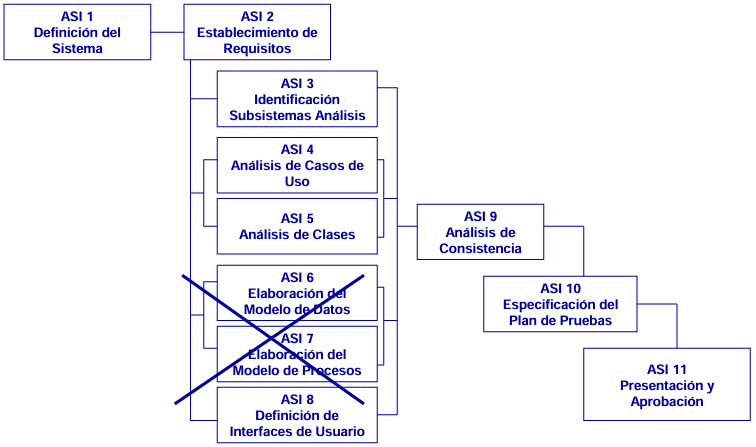

---
# Análisis del Sistema de Información

[Atrás](../README.md)

---
## Introducción
- **Objetivos**
	- Obtener una especificación detallada del Sistema de Información
	- Es la base para el posterior diseño
- **Resultado**
	- Especificación de Requisitos Software.

---
## ASI 1 - Definición del Sistema
**Objetivo**: Definir el sistema, delimitar alcance, interfaces con otros sistemas e identificar usuarios.

---
## ASI 2 - Establecimiento de Requisitos
**Objetivo**: Definición, análisis y validación de los requisitos
### ASI 2.1 y 2.2: Obtención de requisitos y especificación de CUs
- Catálogo de requisitos
	- Requisitos de usuario. Explicación de restricciones en lenguaje natural.
	- Requisitos de sistema. Descripción detallada de servicios del sistema. (técnico)
- **MODELADO FUNCIONAL**
	- Diagrama de casos de uso
		- Caso de uso (CU). Verbo que indica una acción en el sistema de información.
		- Actores. Tipo de usuario en el sistema que participa en casos de uso.
		- Relaciones. Asociación entre actores y casos de uso. (Quién hace qué)
	- Descripción de casos de uso (Caso de uso + objetivo + flujo + excepciones)
		- Flujo principal. Lo que sucederá habitualmente al ejecutar el caso de uso.
		- Flujos alternativos. Variantes (excepcionales) del flujo principal.
	- Proceso *Cockburn*
		- 1 - Lista de actores y objetivos.
		- 2 - Principales escenarios con éxito.
		- 3- Condiciones que provocan fallo.
		- 4 - Tratamiento de esas condiciones.
- Enfoques
	- Incremental. Cada iteración termina un "cacho" (división en subsistemas)
	- Iterativo. Cada iteración va mejorando TODO el diseño. 

### ASI 2.3 y 2.4: Análisis y validación de requisitos.
- Cotejar catálogo de requisitos y el resto de la documentación.
- Completar flujos alternativos.
- Validar con stakeholders

---
## ASI 3, 4 y 5
- **ASI 3 - Identificación de Subsistemas de Análisis**
	- Descomponer el sistema en subsistemas para facilitar el análisis
- **ASI 4 - Análisis de los casos de uso**
	- Para cada CU:
		- Identificar las clases cuyos objetos se necesitan para realizar un caso de uso
		- Describir su comportamiento mediante interacción de dichos objetos
- **ASI 5 - Análisis de clases**
	- Describir cada una de las clases (asociaciones, cardinalidad y herencias)
	- **MODELADO DE DOMINIO**
		- Diagrama de clases (Similar a BD)
			- Cada clase tiene nombre y atributos
			- Siempre se acompaña de un diccionario de datos
			- Asociaciones (línea simple entre clases)
				- Cardinalidad (`1`, `*`, `1..*`, `1..n`...)
				- Nombre (Ej. Trabaja para)
				- Rol (uno en cada extremo) (Ej. Empleado y empleador)
				- Se puede asociar una clase a una asociación de otras clases
				- Restricciones (línea discontinua entre asociaciones)
					- En medio indica XOR, OR, AND...
			- Generalizaciones (flecha de clase hijo a clase padre)
				- flecha apunta a padre
		- Diagrama de transición de estados (asociados a una clase)
			- Estado inicial (punto)  y estado final (punto + circulo)
			- Estados (recuadros)
			- Transiciones (flechas entre recuadros) + evento 
		- Diagramas de actividad
			- Se hacen varias particiones verticales por cada agente.
			- Elementos:
				- Nodo inicial (punto)  y nodo final (punto + circulo)
				- Acciones (recuadros con un caso de uso)
				- Arcos (flechas que indican orden temporal)
				- Paralelización (línea horizontal al que llega una flecha y salen varias)

---
## ASI 8 - Definición de Interfaces de Usuario
**Objetivo**: Especificación de las interfaces usuario-sistema (pantallas, diálogos e informes)
- Se definen criterios generales.
- Para cada prototipo:
	- Partimos de un Caso de Uso.
	- Se añaden descripciones para facilitar comprensión.

---
## ASI 9 - Análisis Consistencia y Especificación Requisitos
**Objetivo**: Comprobar la calidad, coherencia y cumplimiento de requisitos de los modelos.
- Trazabilidad: Casos de Uso/Clases
	- Se hace una tabla con:
		- Casos de uso en el eje x
		- Clases en el eje y
	- En cada intersección o celda se marca con:
		- `I` para insertar
		- `M` para modificar
		- `?` para desconocido
		- Combinaciones `I?` o `M?`.
- Trazabilidad de requisitos
	- Se hace una tabla con:
		- Casos de uso en el eje x
		- Requisitos funcionales en el eje y
	- Se marcan con una `X` las celdas donde el caso de uso se asocie al requisisto.
- Requisitos no funcionales y normas aplicables
	- Normas:
		- Reglamento General de Protección de Datos (RGPD)
		- Ley Orgánica de Protección de Datos Personales y Garantía de Derechos Digitales (LOPD-GDD)
	- Otorga el derecho de … de los datos personales
		- Información
		- Acceso
		- Rectificación
		- Oposición
		- Supresión
		- Limitación de tratamiento
		- Portabilidad

---
## ASI 10 y 11
-  **ASI 10 - Especificación del plan de pruebas**
	- Plan de pruebas.
	- Entorno de pruebas.
	- Pruebas de aceptación.
- **ASI 11 - Aprobación del ASI**

---
