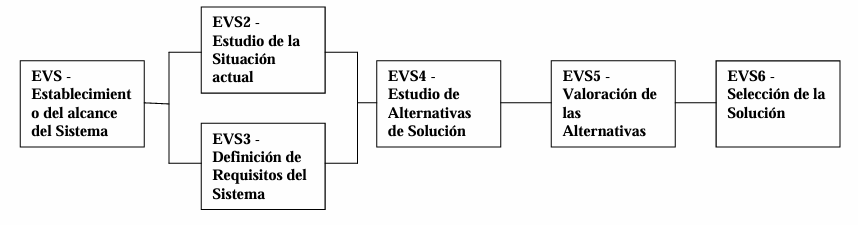

---
# Estudio de la Viabilidad del Sistema

[Atrás](../README.md)

---
## Introducción
- **Objetivos**
	- Analizar las necesidades del cliente/usuario (requisitos)
	- Proponer una solución a corto plazo
- **Resultado**
	- Definición de uno o varios proyectos o su abandono

---
## EVS 1 - Establecimiento del alcance del sistema
**Objetivo**: Comprender que desea el cliente/usuario.
- Estudio de la solicitud.
- Identificación del alcance del sistema y del EVS.
- Objetivos, primeros requisitos y restricciones.

---
## EVS 2 - Estudio de la situación inicial
**Objetivo**: Conocer y describir los sistemas de la información al inicio del estudio.
- Uso de gráficos para representar la situación actual.
- Identificar el tipo de información y como es tratada.
- Identificación de partes interesadas (Stakeholders)
- Diagnostico (problemas, deficiencias y  mejoras)

---
## EVS 3 - Definición de requisitos
**Objetivo**: Concretar lo que debe hacer el sistema
- Se identifican los requisitos de usuario en el EVS
- Se catalogan los requisitos
	- Funcionales (cosas que hace)
	- No funcionales (rendimiento, seguridad, usabilidad, etc.)

---
## EVS 4, 5 y 6
- **EVS 4 - Estudio de alternativas**
	- Diferentes alternativas y su descripción.
- **EVS 5 - Valoración de alternativas**
	- Requisitos cubiertos.
	- Inversión (viabilidad económica) 
	- Riesgos
	- Otros detalles de implantación como la sincronización con otros procesos.
- **EVS 6 - Selección de la solución**
	- Se presentan y debaten las alternativas.
	- Se introducen modificaciones si fuesen necesarias.
	- Finalmente se aprueba una de ellas.
---

