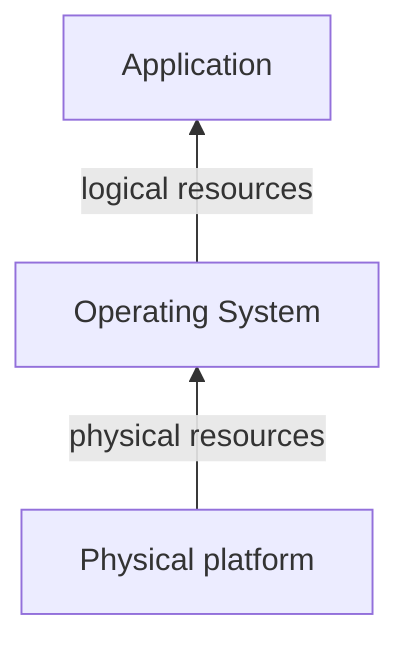

# Virtualization technologies
---
[Go Back](../README.md)

---
## Introduction
- Computer systems present a layered structure:

- Virtualization = **modified view** of resources that one layer provides to its upper layer
- We consider a new layer in between called the **virtualization layer**.
---
## Resource virtualization
- Modified view of a physical resource
- Virtualization layer can be:
	- In the **Physical Platform** (By hardware)
		- Disk virtualization through a physical RAID controller
		- Virtualization layer in the controller firmware
	- In the **Operating System** (By software)
		- Main memory virtualization through the virtual memory
		- Virtualization layer in the OS memory management subsystem
---
## Platform virtualization
- Mechanism for generating virtual execution platforms (Hypervisor - HV)
- To avoid OS modification, they adapt to virtual platforms through drivers.
- Now a single server hosts multiple servers.
- Method to void server proliferation (are expensive and have low utilization)
- There are two types of virtualization
	- **Full virtualization**. Guest OS without modifications except for the drivers.
		- **Binary translation**.
			- Privileged and I/O instructions are translated
			- Less performance. Not used nowadays
			- Invented by VMWare in 1998
		- **Hardware-assisted**. 
			- CPU has a special mode.
			- Privileged and I/O instructions produce an exception that gives control to HV.
	- **Paravirtualization**. Guest OS is modified to cooperate with the HV.
		- Privileged and I/O instructions are replaced by calls to the HV.
		- Significantly better performance for I/O operations. (Best for drivers)
		- Usually  combined with other virtualization:
			- Hardware-assisted for memory management and privileged instructions
			- Paravirtualization for drivers.
### Type 1 - Native or Bare-metal Hypervisor
- Virtualization layer directly on top of the physical platform.
- Two types:
	- **Micro-kernel architecture**
		- It is a minimal kernel (1MB) that manages processor, memory and interruptions.
		- There is a privileged machine that:
			- Manages I/O operations.
				- Every VM has a front driver that manages the virtual I/O operations.
				- Privileged VM has:
					- A native driver that manages the real I/O operations.
					- A rear driver that connects every VM front driver to the native one.
			- Manages VMs with a management tool.
		- Examples:
			- Xen. Each VM is a domain (0 privileged and 1, 2, 3... other VMs)
			- Hyper-V. Each VM is a partition (father and child VMs)
	- **Monolithic kernel architecture**
		- The kernel is small (32MB) and manages processor, memory, interruptions and I/O.
		- Primary used for server virtualization.
		- To manage the VMs:
			- An external machine with an administrative tool is required.
			- A process controls the connection through the network
		- Driver distribution
			- Each VM has a Guest OS Driver for managing its Virtual IO operations.
			- The Hypervisor (HV) has a a I/O Stack connected to the Native drivers.
		- Examples. VMWare ESXi
### Type 2 - Hosted Hypervisor
- Virtualization layer is on top of a general purpose OS.
- The host OS provides support for I/O management.
- The VMs are managed with a virtualization application.
- Examples. Virtual Box, VMWare Workstation, VMWare Player.
- Mainly used in virtualization inside users computers.
### Kernel-level virtualization
- In case of linux, it integrates a virtualization module inside the OS kernel.
- It is called Kernel-based Virtual Machine (KVM)
- The VMs are managed with a application that runs on top of the linux OS.
- Used in server virtualization.
---
## Operating system virtualization
- One virtualization layer on top of an OS.
- Provides isolated environments (containers) for application execution on top of a base OS.
- Docker concepts.
	- **Docker engine**. Is the docker container runtime environment.
		- Composed by the **docker client** and **docker daemon**.
	- **Docker container**. Is an isolated environment running on top of the docker engine.
	- **Docker image**. Is a package that can be instantiated to run as a docker container.
	- **Docker register**. Is a centralised repository that contains docker images.
- Benefits. Lightweight and standardised system.
---
## Platform vs OS virtualization
- Advantages of platform virtualization. (flexibility)
	- Each platform can run a different OS.
	- Each platform has its own emulated hardware.
- Advantages of OS virtualization
	- All containers share a single OS so they have a lower disk and memory usage.
	- Containers do not manage a complete OS, obtaining a better performance.

---
## Application virtualization
- One virtualization layer on top of an OS for each application.
- Provides isolated configuration and storage environments.
- Examples. Microsoft App-V, Snap, Python environments.
---