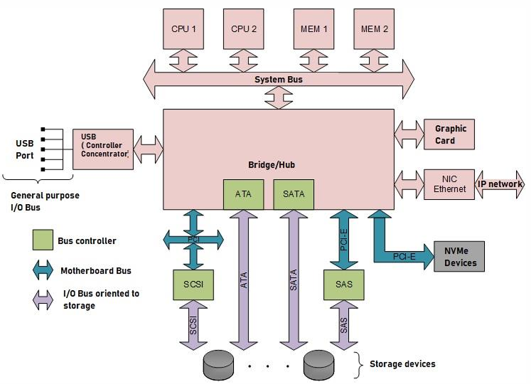

# Storage technologies
---
[Go Back](../README.md)

---
## Introduction
- Options for permanent storage.
	- Hard Drive Disk (HDD) - magnetic
	- CD/DVD - optic
	- Solid State Drive - flash memory
- Use cases
	- Desktop computer. Looks for simplicity, usually a single disk.
	- Server storage
		- Looks for high capacity, high performance, fault tolerant and high availability.
		- Multiple disks managed by a controller
---
## Connection hierarchy of modern computers

- The hub/bridge is also called concentrator subsystem or chipset
- Each bus has three lines and used only 1 simultaneously
	- Address line. Contains the memory location of the accessed device.
	- Control line. Contains the actual data.
	- Data line. Carries control signals (R/W)
- Bus controller alternatives
	- Bus controller in motherboard
		- Controller integrated in the chipset or connected to a motherboard bus.
		- A I/O bus can be connected to the controler.
	- Bus controller in HBA
		- Motherboard bus provides an expansion slot.
		- A bus controller (Host Bus Adapter - HBA) can be connected.
---
## I/O Buses
### Introduction
- Standardisation
	- Allows integration between different manufacturers
	- Standards created by groups of manufacturers such as INCITS
- Bus standard features
	- Physical features
	- Logic architecture
	- Programming interface
### Parallel Buses
- **Advanced Technology Attachment (ATA)**
	- Developed by Western Digital.
	- Controller is integrated in the motherboard chipset.
	- 7 versions from ATA-1 to ATA-7
	- Better bandwidth: 113.3 MB/s (ATA-7)
	- Find in personal computers.
- **Small Computer System Interface (SCSI)**
	- Controller connected through a HBA.
	- 9 versions from SCSI-1 to ULTRA320 SCSI
	- Better bandwidth: 320 MB/s (ULTRA320-SCSI)
	- Find in server & external storage systems

| Bus name    | # of lines | # devices                |
| ----------- | ---------- | ------------------------ |
| ATA         | 16 bits    | 1 master + 1 slave       |
| Narrow SCSI | 8 bits     | 1 controller + 7 devices |
| Wide SCSI   | 16 bits    | 1 controller +15 devices |
### Serial Buses Description
- Advantages over parallel buses:
	- **Performance**
		- Parallel bus have better width while serial has better frequency.
		- Parallel buses have a limited frequency (electromagnetic noise)
		- This restriction is more significant as the bus length increases.
	- **Used space (footprint)**
		- Serial wires are narrower and take less space .
		- Serial communication requires fewer conductors and pins.
- Bus controllers provide connection points for serial link called **ports**.
- Types of connections:
	- Single-port bus controllers
		- Point to Point (P2P)
		- Using a concentrator
	- Multi-port bus controllers

### Serial Buses
- **Both**
	- Bidirectional channel using 7 conductors (4 data and 3 for security)
	- Compatible with predecesor in the programming interface but not physically.
	- For calculating bandwidth we consider
		- 1 byte = 10 bits
		- Each cycle 1 bit is transferred
- **Serial ATA (SATA)**
	- Usually multi-port controller each one using P2P connections.
	- Up to 15 devices using 1 HUB.
	- Used in personal computers, low-end servers and always for optical devices.
- **Serial Attached SCSI (SAS)**
	- Can be connected with narrow port (x1) or wide port (x2, x4, x8).
	- Can be connected with P2P or with up to two levels of expanders (16 devices).
	- SAS Domains
		- Each SAS controller has ports.
		- Each SAS port defines a domain.
		- Each SAS domain has:
			- 1 initiator (the port)
			- Several devices connected to that port (ignoring SAS expanders)
	- Used in mid-range or high-end servers and always for optical devices.
	- SAS with double port
		- Redundant connection to both HDDs and SSDs
		- SSDs can benefit from double transfer rate
	- SAS controller implements SATA protocol

---
## Non-Volatile Memory Express (NVMe)
- Logical interface for accessing non-volatile memory devices over PCIe
- Implemented in the device drivers 
- It is designed to exploit SSD features (parallelism in accessing storage)
- Supported by W10, WS1012 and Linux 3.3 or higher.
- It has a much greater command queue than SAS/SATA
- Form factors
	- PCIe expansion card (x4 or x8)
	- M.2 card (x2 or x4)
	- SFF device (x4)

---
## Hard Drive Disk (HDD)
- Information is stored in several platters
	- Each platter has tracks and sectors
- Types
	- Large Form Factor (LFF) 3,5"
	- Small Form Factor (SFF) 2,5"
- Has a caché for increased performance
- Can be connected with SATA or SAS (allows 2 data ports for redundancy)
- The reliability is measured by the Annualised Failure Rate (AFR)
- Performance
	- Head positioning 
		- Average seek time (inverse of I/O operations/second) + Latency
		- Relevant for random access (Relational databases)
	- Obtaining data
		- Transfer rate
		- Relevant for sequential access (video streaming)
---
## Solid State Drive (SSD)
- Based on flash memory
- Connected through SAS/SATA/PCIe
- Types
	- **M.2**: SATA / PCIe x2 / PCIe x4
	- **2,5" SFF**: SATA / SAS / PCIe x4 (U.2 connector)
	- **Standard PCIe expansion card**: PCIe x4 / PCIe x8
---
## HDD vs SSD

| Features                      | Comparative                           |
| ----------------------------- | ------------------------------------- |
| Maximum capacity              | Similar                               |
| Random access performance     | SSD much better                       |
| Sequential access performance | SSD better                            |
| Reliability                   | Similar                               |
| Cost/ GB                      | SSD more expensive(x4, approximately) |

---
## Redundant Array of Independent Disks (RAID)
- Some I/O bus controllers allow to manage physical disks in groupings called virtual disks.
- This provides better performance and fault tolerance.
- Based on the concept of stripping (information fragmentation)
- A cache is used for better performance (required with HDDs)
- Types
	- **RAID 0. Striping**. Several disks as a single virtual one.
	- **RAID 1. Mirroring**. Data is copied in two disks.
	- **RAID 10**. Mix RAID 1 and RAID 0. More than 2 disks organised in pairs.
	- **RAID 5. Parity**. For each N-1 disk a strip that allows reconstruction is stored.
	- **RAID 6. Double Parity**. Same as RAID 5 but for N-2 disks with 2 parity strips.

| RAID Level | Min Disks | Redundancy  | Storage efficiency | R operation     | W operation   |
| ---------- | --------- | ----------- | ------------------ | --------------- | ------------- |
| 0          | 2         | No          | $1$                | $N\times P$     | $N\times P$   |
| 1          | 2         | 1 disk loss | $1/2$              | $2\times P$     | $P$           |
| 10         | 4         | 1 disk loss | $1/2$              | $N\times P$     | $N/2\times P$ |
| 5          | 3         | 1 disk loss | $(N-1)\:/\:N$      | $(N-1)\times P$ | $N/4\times P$ |
| 6          | 4         | 2 disk loss | $(N-2)\:/\:N$      | $(N-2)\times P$ | $N/6\times P$ |

---