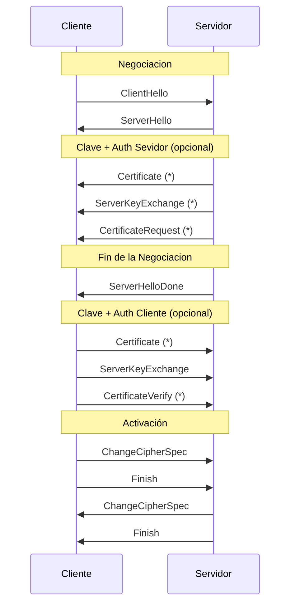

---
# SSL/TLS

[Back to index](../README.md)

---

## Seguridad en las Comunicaciones. Enfoques.
- **Protocolo separado**
	- Inserta capa o protocolo en la pila entre aplicación (HTTP) y transporte (TCP)
	- Secure Sockets Layer (SSL) y su evolución Transport Layer Security (TLS)
	- Ejemplo. Hyper-Text Transfer Protocol Secure (HTTPS)
		- La seguridad no la proporciona el protocolo HTTPS (puerto 443) sino SSL/TLS
- **Integrada en Protocolo de Aplicación**
	- Conjunto de funciones de seguridad en el propio protocolo de aplicación
	- Ejemplo. Secure HyperText Transfer Protocol (S-HTTP). Menos popular.
- **Integrada en el protocolo de transporte/red**
	- Servicios de seguridad como parte opcional del protocolo de transporte/red
	- Ejemplo. IPsec (obligatorio para IPv6 y extensión para IPv4)
- **Protocolo paralelo**
	- Protocolo de seguridad se ejecuta en paralelo con el resto de protocolos 
	- Ejemplo. Kerberos (desarrollado por MIT)
---
## SSL/TLS
### Introducción
- **Objetivos**
	- Establecer canal cifrado
	- Autenticar servidor ante cliente y cliente ante servidor
- **Roles**
	- El cliente inicia la comunicación y propone conjunto de opciones SSL
	- El servidor responde a las peticiones y elige una opción entre las propuestas.
- **Criptografía**
	- A cada mensaje se le concatena un MAC (hash)
	- Luego se cifra con la llave de cifrado (key)
	- Se añade relleno hasta completar el tamaño del algoritmo de cifrado.
- **Estados**. Cada host tiene una tabla con filas: Encriptar - MAC - Key 
	- **Modo**
		- `WRITE`. Define algoritmos y clave usados para enviar.
		- `READ`. Define algoritmos y clave usados para recibir.
	- **Uso** (para cada modo)
		- `PENDING`. Algoritmos y clave asignados pero esperando activación.
		- `ACTIVE`. Algoritmos y clave activados (en uso).
- **Finalización**
	- Se envía un mensaje `ClosureAlert` para indicar que no se van a enviar más mensajes.
	- Evita ataques por truncación. Se puede detectar si falta información.
### Funcionamiento

1. **Partes obligatorias**
	1. `ClientHello`. El cliente envía las opciones que acepta.
	2. `ServerHello`. El servidor escoge que opciones usar.
	3. `ClientKeyExchange` paso que determina la clave a usar.
	4. `ChangeCipherSpec` Pasa opciones de `Pending` a `Active`.
2. **Dependiendo de escenario**
	1. Si solo comunicaciones cifradas
		1. Se usan `ServerKeyExchange` y `ClientKeyExchange` para acordar la clave.
	2. Si se autentica el servidor con la misma clave que se cifra la clave de sesión
		1. Servidor envía `Certificate` para autenticación y con la clave pública integrada.
		2. `ClientKeyExchange`. Contiene la clave de sesión cifrada con la clave publica.
	3. Si se autentica el servidor con la distinta clave que se cifra la clave de sesión
		1. Igual que en el anterior pero se cifra la clave de sesión con otra clave.
		2. Además se envía `ServerKeyExchange` con la clave pública para cifrar sesión.
	4. Autenticar servidor y cliente
		1. Similar a cualquiera de las dos anteriores con autenticación.
		2. Además el servidor envía `CertificateRequest` que el cliente no puede rechazar.
		3. El cliente se autenticará con `Certificate` y `CertificateVerify`.
---