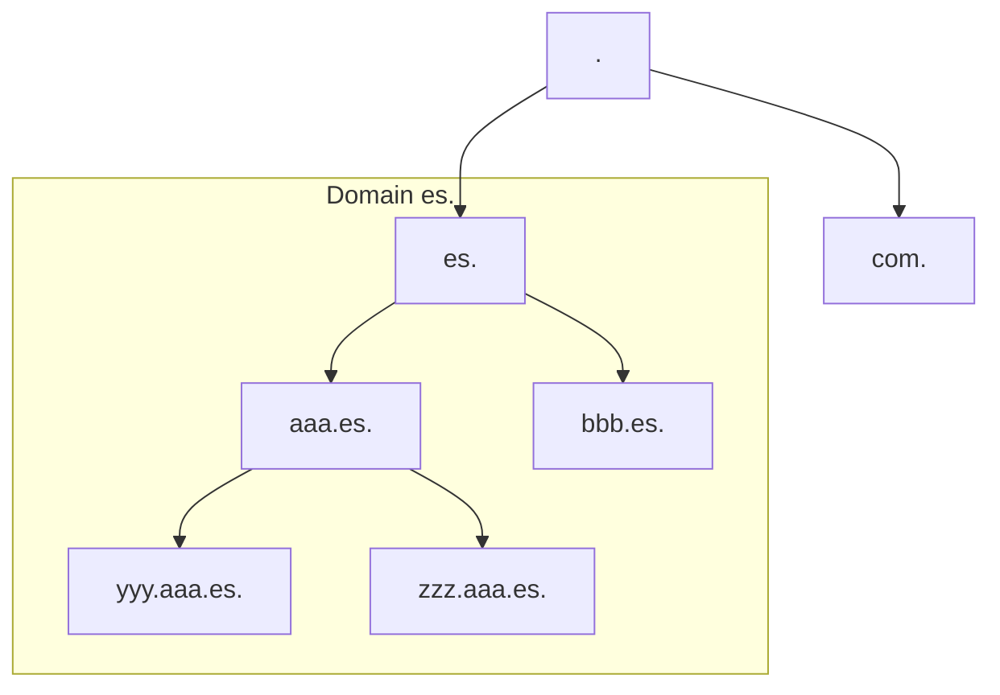

---
# DNS (Domain Name Server)

[Back to index](../README.md)

---

## Introducción
- **Def**. Asocia nombres de máquinas a IPs.
- **Solución Inicial**: Archivo `hosts.txt` contenía asignaciones manuales.
- **Modelo actual**:
	- Cliente (*resolver*) / Servidor (*nameserver*)
	- Espacio de nombres jerárquico (árbol)
	- Base de datos distribuida.
---
## Espacio de nombres

- The root node is called "dot".
- Each node is the root of another tree called Domain