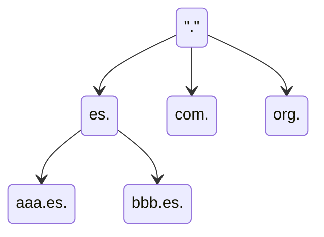
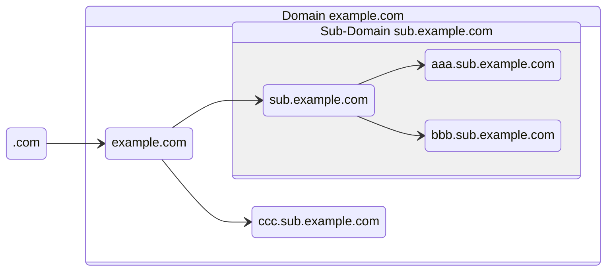
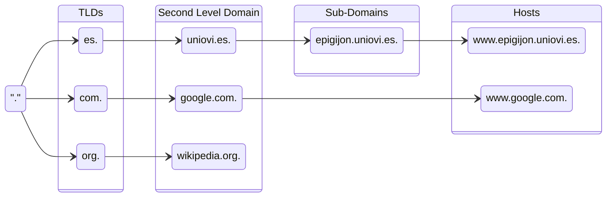

---
# DNS (Domain Name Server)

[Back to index](../README.md)

---

## Introducción
- **Def**. Asocia nombres de máquinas a IPs.
- **Solución Inicial**: Archivo `hosts.txt` contenía asignaciones manuales.
- **Modelo actual**:
	- Cliente o *resolver* / Servidor o *nameserver* (NS)
	- Espacio de nombres jerárquico (árbol)
	- Base de datos distribuida.
---
## Espacio de nombres
### Definición
Forma de árbol (jerárquica) donde el nodo raíz es llamado "dot".

### Dominios
- Conjunto de nodos que forman un sub-árbol y reciben el nombre de su nodo raíz.

### Hosts
- Equipos que disponen de IP única y son identificados por uno o varios nombres (nodos). 
- Las hojas del árbol siempre son *hosts*.
- Los nodos intermedios pueden ser *hosts* además de *nameservers*.
### Jerarquía
- Los hijos directos del nodo raíz se llaman *Top-Level Domains* (TLDs)
	- **Geográficos** (ccTLDs). Uno por país como `.es`, `.uk` o `.jp`.
	- **Genéricos** (gTLDs). Como `.com`, `.org` o `.edu`. Puede haber extensiones.
- Los hijos de los TLDs se llaman dominios de segundo nivel
	- Suelen pertenecer a un propietario de dominio (empresa, universidad...)
- Los hijos de los Dominios de segundo nivel son subdominios o hosts

---
## Zonas
- **Def**. Conjunto de nodos del espacio de nombres gestionados por un *nameserver* específico.
	- Este NS se llama Autoridad de Zona
		- Dispone de toda la información de los nodos en la zona.
		- Sus respuestas son "definitivas" (*authoritative*)
	- La zona puede estar formada por un dominio completo o una parte de él.
- Proceso delegación
	- Se crea una nueva sub-zona (sub-conjunto del espacio de nombres).
	- El NS original borra la información referente a la nueva sub-zona.
	- Otro NS guarda la información y se convierte en Autoridad de Zona de la nueva sub-zona.
---
## Base de datos
- Nombres de dominios como índices.
- El contenido asociado a un índice se llama Resource Record (RR)
	- Si es nodo o sub-zona.
	- Si es un servidor de nombres
	- La IP, su nombre canónico y sus otros nombres.
	- Datos de registro (persona de contacto, email, geolocalización...)
---
## Implementaci