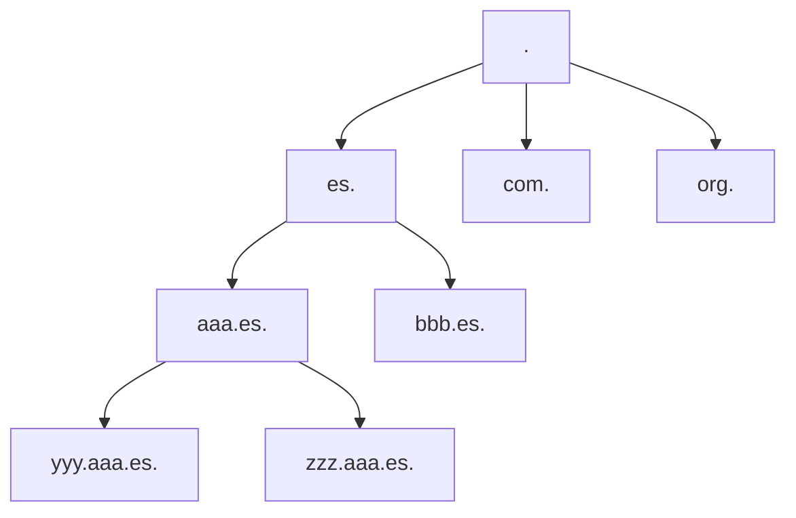
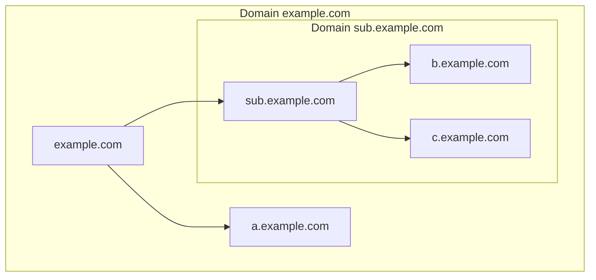

---
# DNS (Domain Name Server)

[Back to index](../README.md)

---

## Introducción
- **Def**. Asocia nombres de máquinas a IPs.
- **Solución Inicial**: Archivo `hosts.txt` contenía asignaciones manuales.
- **Modelo actual**:
	- Cliente (*resolver*) / Servidor (*nameserver*)
	- Espacio de nombres jerárquico (árbol)
	- Base de datos distribuida.
---
## Espacio de nombres
### Definición
Forma de árbol donde el nodo raíz es llamado "dot".

### Dominios
- Conjunto de nodos que forman un sub-árbol.
- Reciben el nombre de su nodo raíz.

### Hosts
- Equipos que disponen de IP única y son identificados por un nombre. 
- Puede ser un dominio a su vez.
## Zonas
- **Def**. Conjunto de nodos del espacio de nombres gestionados por un *nameserver* específico.
	- Este *nameserver* se llama Autoridad de Zona
		- Dispone de toda la información de los nodos en la zona.
		- Sus respuestas son "definitivas" (*authoritative*)
	- La zona puede estar formada por un dominio completo o una parte de él.
- Se puede delegar la gestión de una parte del espacio de nombres.
---
## Top-Level Domains (TLD)
- Los hijos directos del nodo raíz
	- **Geográficos** (ccTLDs). Uno por país como `.es`, `.uk` o `.jp`.
	- **Genéricos** (gTLDs). Como `.com`, `.org` o `.edu`. Puede haber extensiones.
---
## Base de datos
- Nombres de dominios como índices.
- El contenido asociado a un índice se llama Resource Record (RR)
	- Si es nodo o sub-zona.
	- Si es un servidor de nombres
	- La IP, su nombre canónico y sus otros nombres.
	- Datos de registro (persona de contacto, email, geolocalización...)
---