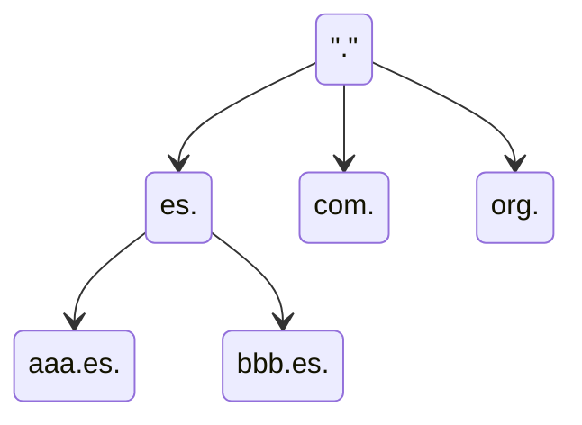
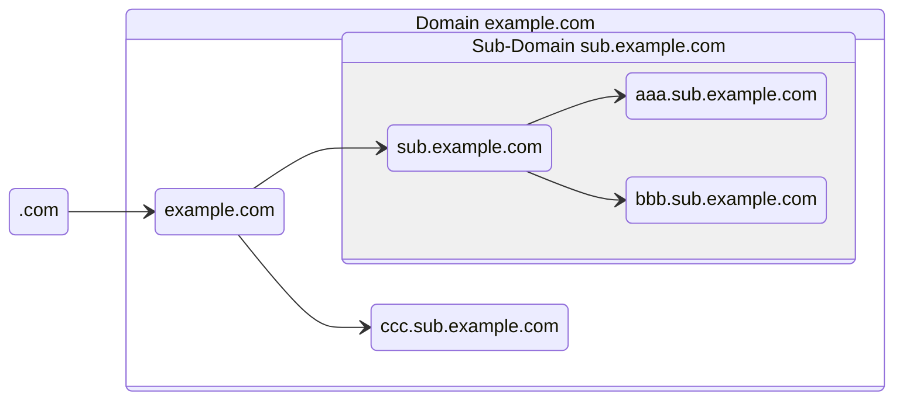
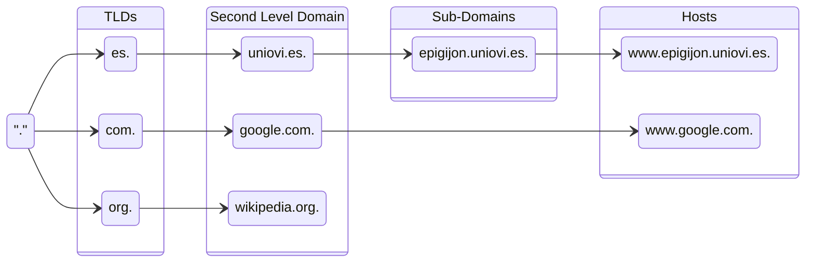

---
# DNS (Domain Name Server)

[Back to index](../README.md)

---

## Introducción
- **Def**. Asocia nombres de máquinas a IPs.
- **Solución Inicial**: Archivo `hosts.txt` contenía asignaciones manuales.
- **Modelo actual**:
	- Cliente o *resolver* / Servidor o *nameserver* (NS)
	- Espacio de nombres jerárquico (árbol)
	- Base de datos distribuida.
---
## Espacio de nombres
### Definición
Forma de árbol (jerárquica) donde el nodo raíz es llamado "dot".

### Dominios
- Conjunto de nodos que forman un sub-árbol y reciben el nombre de su nodo raíz.

### Hosts
- Equipos que disponen de IP única y son identificados por uno o varios nombres (nodos). 
- Las hojas del árbol siempre son *hosts*.
- Los nodos intermedios pueden ser *hosts* además de *nameservers*.
### Jerarquía
- Los hijos directos del nodo raíz se llaman *Top-Level Domains* (TLDs)
	- **Geográficos** (ccTLDs). Uno por país como `.es`, `.uk` o `.jp`.
	- **Genéricos** (gTLDs). Como `.com`, `.org` o `.edu`. Puede haber extensiones.
- Los hijos de los TLDs se llaman dominios de segundo nivel
	- Suelen pertenecer a un propietario de dominio (empresa, universidad...)
- Los hijos de los Dominios de segundo nivel son subdominios o hosts

---
## Zonas
- **Def**. Conjunto de nodos del espacio de nombres gestionados por un *nameserver* específico.
	- Este NS se llama Autoridad de Zona
		- Dispone de toda la información de los nodos en la zona.
		- Sus respuestas son "definitivas" (*authoritative*)
	- La zona puede estar formada por un dominio completo o una parte de él.
- **Proceso delegación**
	- Se crea una nueva sub-zona (sub-conjunto del espacio de nombres).
	- El NS original borra la información referente a la nueva sub-zona.
	- Otro NS guarda la información y se convierte en Autoridad de Zona de la nueva sub-zona.
- **Redundancia y load-balancing**
	- Puede haber varios NS para la misma zona que sean Autoridad de Zona.
	- Hay un NS primario con los datos en un fichero local
	- Hay varios NS secundarios que obtienen datos del NS primario.
---
## Implementación BIND
- *Nameservers* (proceso `named`)
	- Son complejos.
	- Si no tienen la respuesta hacen consultas de tipo iterativo.
	- El primer NS consultado asume la mayor carga de trabajo.
- Resolvers (funcionalidad `gethostbyname()`)
	- Código simple. Es una biblioteca, no un proceso.
	- Hacen consultas de tipo recursivo.
---
## Proceso de Resolución
### Base de datos
- Nombres de dominios como índices. (Ej. `www.uniovi.es.`)
- El contenido asociado a un índice se llama Resource Record (RR)
	- Si es nodo / sub-zona / servidor de nombres / etc
	- La IP, su nombre canónico y sus otros nombres.
	- Datos de registro (persona de contacto, email, geolocalización...)
- **Campos de un registro**. Hay varias con el mismo índice (mismo RR)
	- **TTL**. Tiempo es segundos que se puede almacenar en caché
	- **Clase**. Casi siempre `IN` (Internet)
	- **Tipo de registro**.
		- `SOA`. *Start of Authority*. NS que es Autoridad de Zona e información sobre esta.
		- `NS`. *Name Server*. Información sobre servidores de nombres para ese dominio.
		- `A`. *Address*. Dirección IPv4 para ese dominio o host.
		- `AAAA`. Dirección IPv6 para ese dominio o host.
		- `CNAME`. *Canonical Name*. Nombre oficial para dominio. Índice es un alias.
		- `PTR`. *Pointer*. Usado para resolver IP (índice) a nombre. (Resolución Inversa)
		- `MX`. Mail Exchange. Usado para el protocolo SMTP (datos precedidos de prioridad)
	- **Datos**
### Tipos de Resolución (Directa)
- **Consulta Recursiva**
	- Puede que el NS no disponga de la información para resolver el nombre.
	- Es el NS el encargado de contactar a otros NS para encontrar la respuesta.
- **Consulta Iterativa**
	- Si el NS no encuentra la información, devuelve una referencia a otro NS que puede tenerla.
	- Es el *resolver* el encargado de contactar al otro NS para encontrar la respuesta.
### Resolución Inversa
- **Def**. Obtener el nombre asociado a una IP.
- **Uso**. Mostrar nombres de máquinas en logs de conexiones.
- **Funcionamiento**. Se define el dominio `in-addr.arpa` con sus *nameservers*, zonas, etc.
	- Para resolver la IP `A.B.C.D` se consulta `D.C.B.A.in-addr.arpa`.
	- El RR correspondiente tendrá una entrada `PTR` con el nombre de la máquina.
---