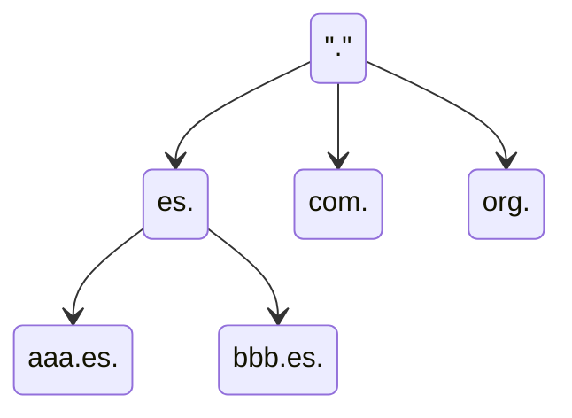
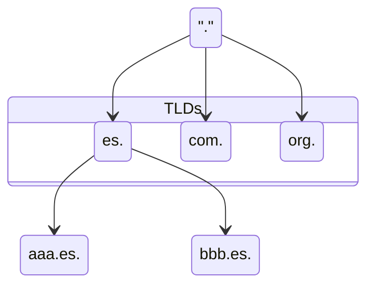

---
# DNS (Domain Name Server)

[Back to index](../README.md)

---

## Introducción
- **Def**. Asocia nombres de máquinas a IPs.
- **Solución Inicial**: Archivo `hosts.txt` contenía asignaciones manuales.
- **Modelo actual**:
	- Cliente (*resolver*) / Servidor (*nameserver*)
	- Espacio de nombres jerárquico (árbol)
	- Base de datos distribuida.
---
## Espacio de nombres
### Definición
Forma de árbol (jerárquica) donde el nodo raíz es llamado "dot".

### Dominios
- Conjunto de nodos que forman un sub-árbol y reciben el nombre de su nodo raíz.
```mermaid
stateDiagram-v2

	TLD : ".com"
	state "Domain example.com" as x
    {
		DOMAIN : "example.com"
		
		state "Sub-Domain sub.example.com" as y
	    {
			SUBDOMAIN : "sub.example.com"
			A : "aaa.sub.example.com"
			B : "bbb.sub.example.com"
		}
		
		C : "ccc.sub.example.com"
	}
	
	TLD --> DOMAIN
	DOMAIN --> SUBDOMAIN
	DOMAIN --> C
	SUBDOMAIN --> A
	SUBDOMAIN --> B
```
### Hosts
- Equipos que disponen de IP única y son identificados por uno o varios nombres (nodos). 
- Las hojas del árbol siempre son *hosts*.
- Los nodos intermedios pueden ser *hosts*, *nameservers* o ambos.
### Jerarquía
- Los hijos directos del nodo raíz se llaman *Top-Level Domains* (TLDs)
	- **Geográficos** (ccTLDs). Uno por país como `.es`, `.uk` o `.jp`.
	- **Genéricos** (gTLDs). Como `.com`, `.org` o `.edu`. Puede haber extensiones.

---
## Zonas
- **Def**. Conjunto de nodos del espacio de nombres gestionados por un *nameserver* específico.
	- Este *nameserver* se llama Autoridad de Zona
		- Dispone de toda la información de los nodos en la zona.
		- Sus respuestas son "definitivas" (*authoritative*)
	- La zona puede estar formada por un dominio completo o una parte de él.
- Se puede delegar la gestión de una parte del espacio de nombres.
---
## Base de datos
- Nombres de dominios como índices.
- El contenido asociado a un índice se llama Resource Record (RR)
	- Si es nodo o sub-zona.
	- Si es un servidor de nombres
	- La IP, su nombre canónico y sus otros nombres.
	- Datos de registro (persona de contacto, email, geolocalización...)
---