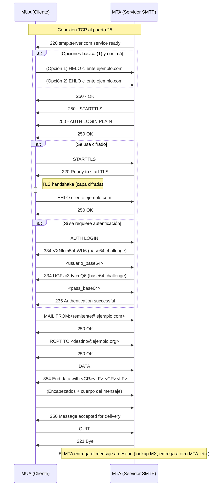

---
# Correo

[Back to index](../README.md)

---

## Introducción
- **Elementos**
	- Remitente y Destinatario
	- Message User Agent (MUA).
		- Cliente instalado en el ordenador del usuario que permite enviar y obtener correos.
	- Message Transfer Agent (MTA)
		- MTA Relay. Actúa como punto de entrada/salida en una intranet. Funciones de proxy.
		- MTA Abierto. Permite envío sin autenticación. Usado por spammers
	- Buzón
		- Almacenado en el MTA destino.
- **Protocolos**
	- SMTP. Se usa para enviar mensajes del MUA al MTA y entre MTAs
	- POP3 e IMAP. Se usan para obtener mensajes del buzón.

---
## Mensaje
### Cabeceras
- **Formato**: Varios `Campo: valor\r\n` y terminadas por `\r\n\r\n`
- **Algunas Cabeceras**
	- Definidas en el MUA
		- `From`, `To`, `Reply-to`, `Cc`, `Bcc`, `Subject`, `Date`, `Message-Id`
	- Añadidas por MTAs: 
		- Por primer MTA, si no las define MUA: `Date`, `From`, `To`, `Message-Id`
		- MTAs intermedios `Received`
		- Añadida por último MTA destino: `Return-Path`
### Cuerpo
- **Formato**. Secuencia de líneas compuestas por caracteres ASCII de `7b`.
- **Multipurpose Internet Mail Extensions (MIME)**.
	- Permite transmitir diversos contenidos como binarios en el cuerpo.
	- Permite varias partes en mismo mensaje (adjuntos, alternativos, etc)
- **Cabeceras**.
	- `MIME-version: <versión>`.
	- `Content-Type: <type>`
		- **Básicas**: `text/plain`, `text/html`, `image/jpeg`, `video/mpeg`...
		- **Multiparte**:  (cada elemento interior tiene sus propias cabeceras)
			- `multipart/mixed`. MUA muestra multiples partes. (Adjuntos, imágenes...)
			- `multipart/alternative`. MUA muestra una de las alternativas.
			- Separación partes:
				- Define cadena arbitraria: `Content-Type: <type>; boundary="<cadena>"`
				- Antes de cada parte `--<cadena>`. Al final de la última `--<cadena>--`
	- `Content-Transfer-Encoding <encoding>`
		- `7bit`. ASCII puro.
		- `quoted-printable`.
			- Caracteres no imprimibles como `=XX` siendo `XX` su código hex.
			- Líneas limitadas a 76 caracteres. Si más largas, `=` al final de la línea cortada.
		- `base64`
			- Grupos de `3B` (`24b`) divididos en trozos de `6b`.
			- Cada trozo codificado como:
				- `0-25 = "A"-"Z"` / `26-51 = "a"-"z"`
				- `52-61 = "0" - "9"` / `62 = "+"` / `63 = "/"`
			- Si contenido no múltiplo de `3B` completar con `0`s. 
				- Si último trozo `1B` terminar con `==`, si `2B` con `=`
---
## Simple Mail Transfer Protocol
- **Def**
	- Sobre TCP.
	- Puede ir autenticado (entre MUA y MTA) y opcionalmente cifrado (TLS)
- **Funcionamiento**. Usa `\r\n`como terminador.
	- Petición: `<comando> <parámetros>
	- Respuesta: `<código> <descripción>`

