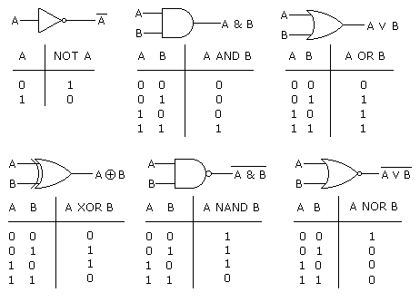
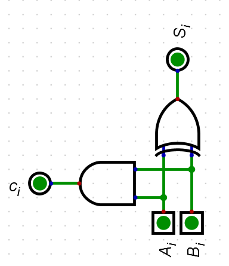
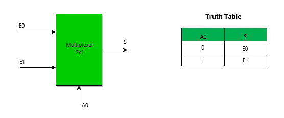
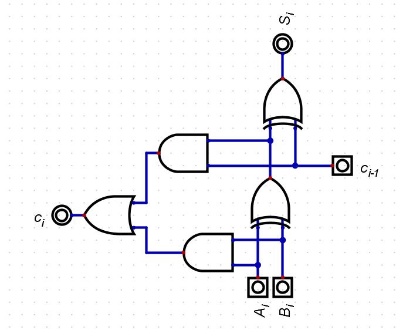
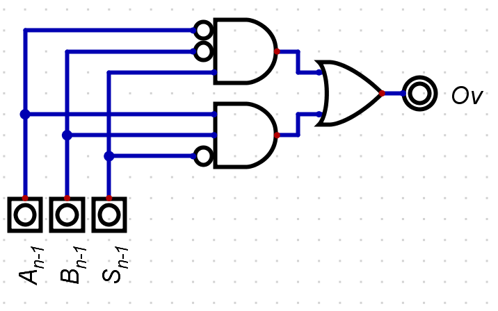
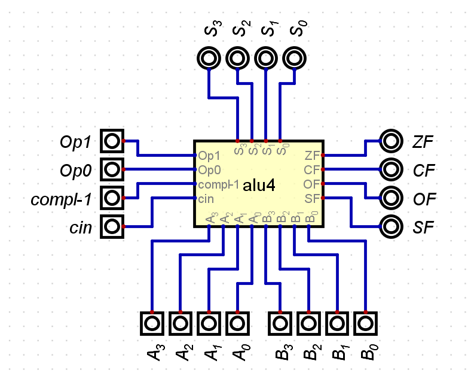

---
# 02 Digital Systems

[Back to index](../CS/OS/README.md)

---
## COMBINATIONAL CIRCUITS
### Basics
Can be represented with:
- Logic function:
$$

S_n = f_n(E_0, E_1, E_2, ..., E_{m-1})

$$
Where `n` is one of the outputs and there are `m` inputs
#### Truth table

| $E_2$ | $E_1$ | $E_0$ | $S$ |
| ----- | ----- | ----- | --- |
| 0     | 0     | 0     | 0   |
| 0     | 0     | 0     | 1   |
| 0     | 0     | 1     | 0   |
| 0     | 0     | 1     | 1   |
| 0     | 1     | 0     | 0   |
| 0     | 1     | 0     | 1   |
| 0     | 1     | 1     | 0   |
| 0     | 1     | 1     | 1   |
| 1     | 0     | 0     | 0   |
| 1     | 0     | 0     | 1   |
| 1     | 0     | 1     | 0   |
| 1     | 0     | 1     | 1   |
| 1     | 1     | 0     | 0   |
| 1     | 1     | 0     | 1   |
| 1     | 1     | 1     | 0   |
| 1     | 1     | 1     | 1   |

1. For the Inputs whose solution $S = 1$ create a $m_i$ that is the result of multiplying the input 1’s and the negation of the input 0’s. As following:
    $m_1 = ¬E_2 * ¬E_1 *  E_0$
    $m_2 = ¬ E_2 *  E_1 * ¬ E_0$
1. Latter the result will be the addition of every $m_i$

### Logic gates

### 1-bit adder
- Receives two 1-bit numbers ( $A$ and $B$ )
- Returns the result ( $S$ ) and the carry ( $C$ )

### Multiplexer

### n-bit adder
- Is a chain of 1-bit adders but with a carry bit in and out

## **Overflow detector**

| $A_{n-1}$ | $B_{n-1}$ | $S_{n-1}$ | $Ov$ |
| --------- | --------- | --------- | ---- |
| 0         | 0         | 0         | 0    |
| 0         | 0         | 1         | 1    |
| 0         | 1         | 0         | 0    |
| 0         | 1         | 1         | 0    |
| 1         | 0         | 0         | 0    |
| 1         | 0         | 1         | 0    |
| 1         | 1         | 0         | 1    |
| 1         | 1         | 1         | 0    |
### Arithmetical-Logic Unit (ALU)

| Operation | Op 0 | Op 1 | C_in | Compl-1 |
| --------- | ---- | ---- | ---- | ------- |
| AND       | 0    | 0    | 0    | 0       |
| OR        | 1    | 0    | 0    | 0       |
| XOR       | 0    | 1    | 0    | 0       |
| ADD       | 1    | 1    | 0    | 0       |
| SUB       | 1    | 1    | 1    | 1       |
#TODO
# SEQUENCIAL CIRCUITS

  

## **D Flip-Flops**

  

- It can store a single bit of information. (Simplest type of memory)

- It has a single data input and a clock input.

- When clock signal ( $C$ ) goes from 0 to 1, the data input ( $D$ ) is stored.

  

  

## **Registers**

  

- It is a way of storing information.

- Formed bay a chain of flip-flops.

- Has two control inputs:

    - WRITE. Stores the info when a rising edge happens.

    - READ. While it is set to 1 reads the info, else the out will be on a high impedance state (z) .

- Types:

    - Same input and output and W/R inputs.

        - Needs a tri-state buffer to avoid short circuits.

        - Sometimes $d$ inputs are used for reading and others for writing

        

    - Different input and output with W/R inputs.

        - Needs a tri-state buffer to avoid short circuits.

        - There are specific inputs for writing ( $e$ ) and others for reading ( $s$ ):

        

    - Different input and output with only write input

        - Do not use a tri-state buffer

        - Always produce an output ( $s$ ) signal

        