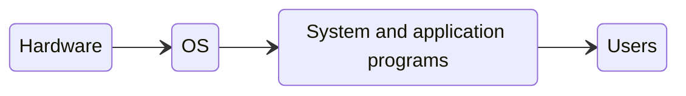
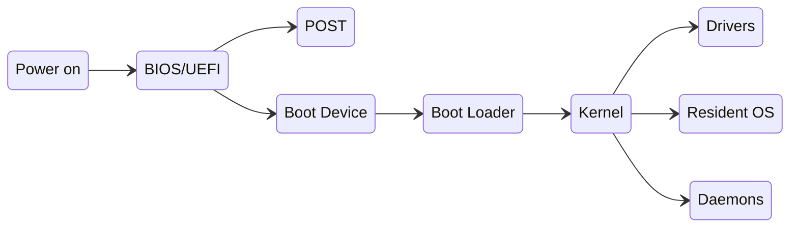

---
# Introduction to Operating Systems

[Back to index](../README.md)

1. [Definition of an operating system (OS)](#definition-of-an-os)
2. [Historic evolution](#historic-evolution)
3. [Functional blocks of an operating system](#functional-blocks-of-an-os)
4. [Booting and halting of the system](#booting-and-halting-of-the-system)
5. [Classification of the operating systems](#Classification-of-the-os)

---

## Definition of an OS

### Computing System

Formed by:
- **Hardware**.
- **Software**:
	- Application programs.
	- System programs (OS and other system programs)
- **Users**.

### Definition of an OS

- Controls the execution of the application programs.
- Works as the interface between the user and the hardware.
- Only program permanently executed in the computer (kernel).

### Types of users

- **Applications user:**
	- Uses application programs.

- **Programmer user:**
	- Uses utilities (programming languages, libraries, compilers...)
	- Requires a **system calls library**:
		- Interface between processes and OS.
		- Call OS services that are executed with high privilege.

- **Developer of the OS.**
	- Interacts with the hardware directly.

---
## Historic evolution

### 1 - No OS
- No users.
- An operator manages a console of switchers, indicators, an input device and a printer.
- Programs written in machine code.

### 2 - Batch processing
- Ancestor of the OS.
- Several users give jobs to the operator.
- Similar jobs grouped in batches.
- Uses punched cards with fortran code.
- Monitor slowly reads one card at a time (**mono-programed**).

### 3 - Multi-programed systems
- First OS.
- I/O times are much higher than CPU ones.
- Memory stores several programs besides the OS.
- CPU may switch between tasks when waiting for I/O.
- Processes can monopolize CPU.

### 4 - Time-sharing systems
- OS distributes CPU time between processes.
- Uses also multi-programming.

### 5 - Modern OS
- Uses new technologies:
	- Real-time OS.
	- Multithread.
	- Symmetric multiprocessing.
	- Distributed OS.
	- Object-oriented design.

---
## Functional blocks of an OS

- **Process management**
	- Creation, elimination, suspension and restarting of processes.
	- Synchronization and communication between processes.

- **Main memory management**
	- Keep track of main memory usage and ownership.
	- Allocate and free memory space.

- **I/O management**
	- Manage peripherical devices.

- **Secondary memory management**
	- Manage free space and operations on disk.
	- Manage files creation, removal, manipulation and location on disk.

- **Security and protection**
	- Manages users identity and operations allowance for each one.

- **Networks**
	- Allows communications between different computers.

- **Command prompt**
	- Can be part of the kernel or a specific program.

---
## Booting and halting of the system 

### Hardware booting steps

1. **Press the ON button.**
	- Invalid information in main memory.

2. **Executes firmware (a booting software).**
	- Stored in a non-volatile memory.
	- Can be updated under secured conditions.
	- Some predefined data is loaded to the CPU registers.
	- Primitive version for PCs is called Basic Input Output System (BIOS).
	- New version is called UEFI (*Unified Extensible Firmware Interface*)

3. **Performs the Power On Self Test (POST)**
	- Basic check of hardware.
	- Done by firmware. Cannot be avoided.

4. **Load the bootloader.**
	- Done by firmware. Cannot be avoided.
	- Code used to load an OS.
	- Stored in Secondary Memory (Easy to rewrite).
	- Can be protected or encrypted by the manufacturer.

5. **Execution of the bootloader.**
	- Firmware cedes absolute control to the bootloader.
	- Both firmware and bootloader are run in supervisor mode.
	- Loads to memory and executes the OS kernel.

### BIOS

#### Description
- Not stored in Secondary Memory (difficult to change).
- Can be protected or encrypted by the manufacturer.
#### Bootloaders
- Located in predefined areas in the disk:
	- First sector of the disk (MBR: *Master Boot Record*).
	- First sector of each partition (VBR: *Volume Boot Record*).
- Have a predefined size and they are OS independent.
- Can be written by third parties.
- BIOS tries to executes bootloaders in the disk in order.
	1. Try to execute bootloader in MBR
	2. Try to execute the VBRs in order:
	3. If no bootloader is found, it prompts an error and stops.

#### Limitations
- Maximum 4 primary partitions.
- Allow one of that primary partitions to be a extended partition.
	- It is divided in logical units that cannot be directly used.
	- Each logical unit can contain a bootloader.
- Booting flag:
	- Can only be active in one partition.
	- Only primary partitions can have it.

### UEFI

#### Description
- Provides graphical interface.
- Allows GPT partition tables.
- Executes directly EFI executables.
- Allows secure booting and emulation of BIOS booting.
#### Bootloaders
- The bootloaders are EFI-like executables.
- All bootloaders are stored in a special partition (EFI partition).
- Uses GPT partition table with:
	- Unlimited number of partitions.
	- Partition sizes much bigger than BIOS.
	- All partitions of the same type.
- Firmware loads only one bootloader according to an stablished order.

### Several devices
- BIOS/UEFI elaborates an ordered list with the devices.
- It may not contain all the devices (can be empty).
- It is editable by the user.

### Types of bootloaders
- Specific for a OS.
- Booting manager.
	- Presents a menu to select a OS from a partition.
	- Any partition with a OS could be selected (not need to be active/primary).
	- Then, it launches the selected bootloader.

### OS booting
- Goals
	- Load the kernel of the OS to the memory.
	- Perform the initialization step:
		- Checks the system (Hardware and coherent file system structure tests)
		- Establish the data structures of the OS (processes, memory tables, I/O...)
		- Load to memory the resident OS
			- Is the set of components always in memory.
			- Creates login process.
			- Prompt welcome message and waits the user to log in.
		- Create set of auxiliary processes and [daemons](https://es.wikipedia.org/wiki/Daemon_(inform%C3%A1tica)).
	- OS keeps in memory critical information
		- Maximizes efficiency.
		- Controlled shutdown is required to avoid corruptions.
		- After forced shutdown OS checks if this info. was corrupted.

---
## Classification of the OS

- Regarding resource management (overall, CPU):
	- Mono-programmed systems.
	- Multi-programmed systems.
	- Multi-processing systems.
- Regarding interactivity (response time):
	- Batch processing systems.
	- Time-shared systems.
	- Real-time systems.
- Regarding the number of users :
	- Single-user systems.
	- Multi-user systems.
---
