---
# Introduction to Processes Management

[Back to index](../README.md)

---
## Interruptions
### Definition
- Interruptions always arrive at the CPU to stop current execution.
- Each interruption is identified by an integer number.
- There exists a table: **Interruptions Vector**.
	- Associates each interrupt number with the address of its subroutine.
	- This table is located in the lower addresses of the main memory.
- The subroutines or **interrupt handlers**:
	- Are OS binaries located in the main memory.
	- Whenever an interrupt occurs the OS takes control.
### Execution Steps
1. An interruption is generated.
2. CPU ends execution of current instruction.
3. CPU registers are saved to the stack.
4. CPU switches to supervisor mode.
5. Address stated by the interrupt vector is loaded to the Program Counter (PC).
6. The interruption management subroutine is executed. 

### Interrupt Ending
Every interruption subroutine ends with the `iret` statement.
1. CPU switches to user mode.
2. Information is recovered from the stack and loaded to the CPU registers.
3. CPU continues running previously stopped process.

### Types of Interruptions.

#### Hardware Interruptions
- Electrical signals arriving to the CPU.
- Essential to allow multiprogramming
- Directly sent when some I/O operation is finished.

#### Software Interruptions
- **System calls**
	- Are lower level functions provided by the OS.
	- Processes willing to use OS services must generate this interrupt.
	- Generated by `trap` machine instruction.
- **Exceptions**
	- Are non voluntarily generated by processes.
	- Generated when a process produces an error.
	- Can be controlled to try solving the error.
	- If there is no solution, the OS ends the process.

---
## Multiprogramming
### Rules
- OS only takes control at boot and with every interruption.
- OS is only executed in supervisor mode.
- Processes never leave the CPU until a interrupt occurs.
- Processes can only end in two ways:
	- The system call `exit` (voluntary termination).
	- An irrecoverable exception (forced termination).
### Example

```mermaid
---
displayMode: compact
---
gantt
    title IO Operation
    dateFormat X
    axisFormat %s
    
    section P2
        exec    : p2_1, after os_2, 4
        exec    : p2_2, after os_3, 6
        
    section P1
	    exec    : p1_1, after os_1, 2
	    IO      : crit, p1_2, after p1_1, 4
	    exec    : p1_3, after os_4, 8

	section OS
		init            : os_1, 0, 1
		IO sys call     : os_2, after p1_1, 3
		IO end    : os_3, after p1_2, 5
		P2 end          : os_4, after p2_2, 7
```

0. OS starts execution (initialises interrupt vectors) and gives control to P1.
1. P1 starts its execution.
2. P1 generates a system call to ask for an I/O operation.
3. The OS gives control to P2 meanwhile the I/O operation is been done.
4. A hardware interruption is generated as the I/O operation ends.
5. P2 execution is resumed as the handler ends.
6. P2 terminates its execution. This can be due to:
7. The OS gives control to P1 again.

---