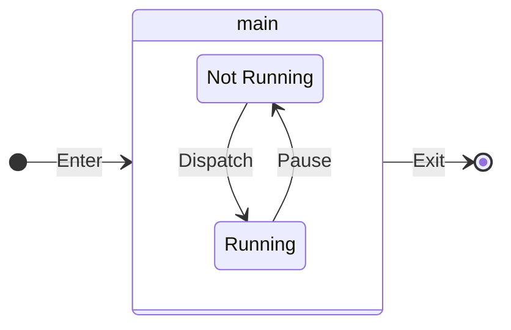
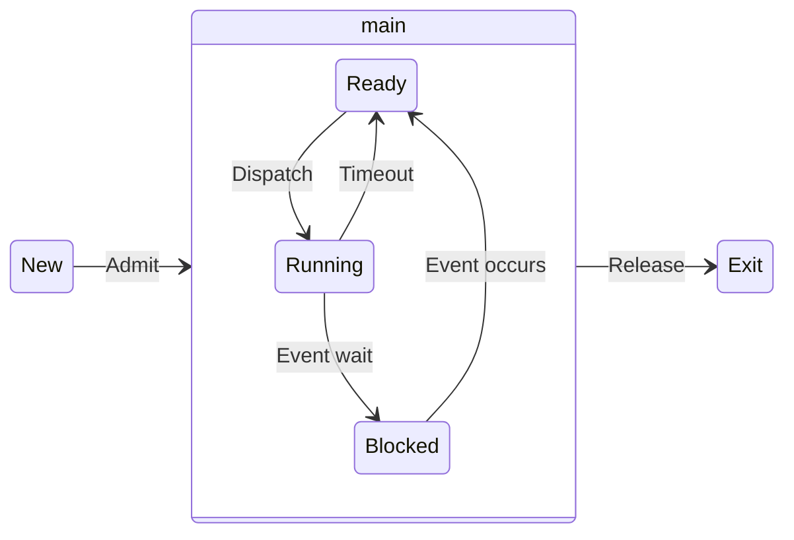
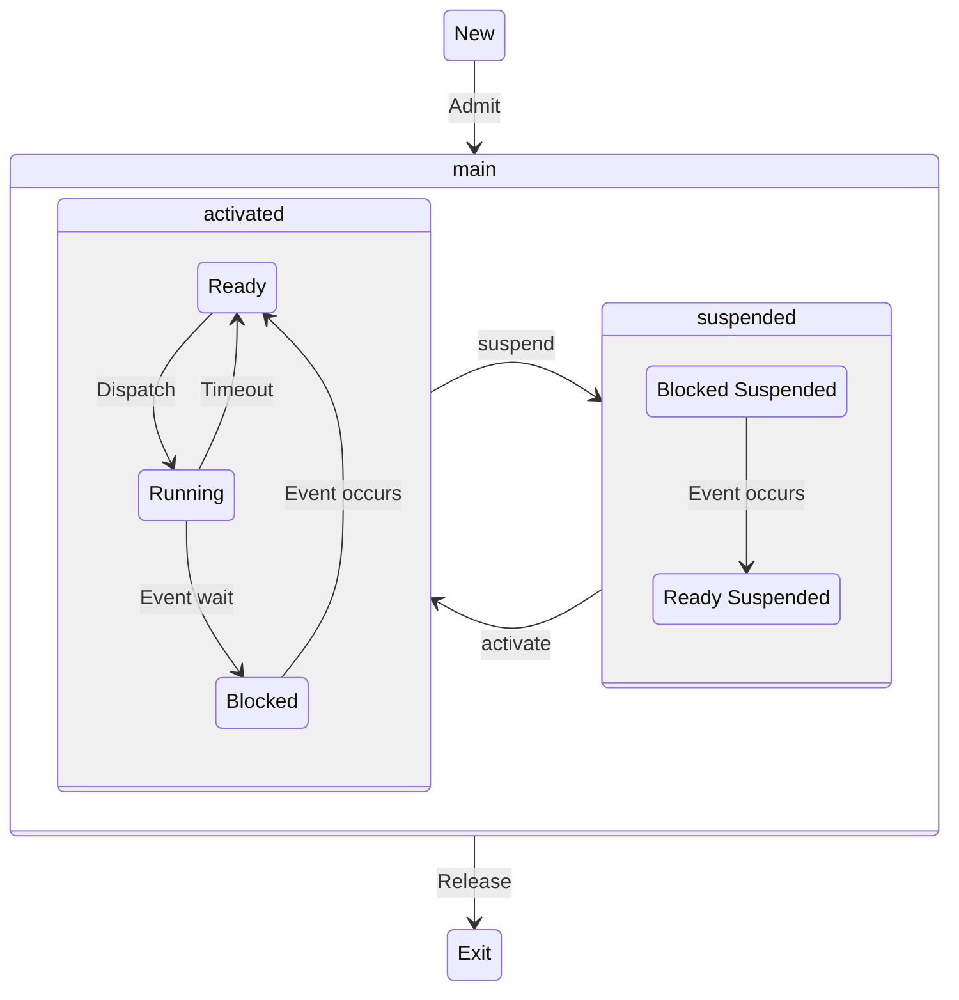

---
# Processes life cycle

[Back to index](../README.md)

---

## Simple model

- Processes start at `not running` state.
- Do not work for multiprogramming.

---
## 5-state model

- There can be not-admitted processes (while being loaded to memory).
- Admitted processes go to `ready` state.
- Processes can end because:
	- Special ending instruction.
	- `exit` system call.
	- Exception.
	- Direct intervention of the OS.
	- Parent process kills it.
	- Other reasons.
- Queues for the `ready` and `blocked` state are needed.

---
## 7-state model

- Allows the OS to suspend processes if it runs out of memory.
- Admitted processes can go to `ready` or `ready suspended` states.