---
# STS Scheduling Algorithms

[Back to index](../README.md)

---
## Understanding metrics

- `P` is the **Process ID**.
- `Ta` is the **Time of Arrival** to the scheduler.
- `CPU-(E/S)` is the sequence of **CPU and IO usage**.
- `Ts` is the **Time of Service** (CPU time + IO time).
- `Te` is the **Time of Ending** of the process.
- `Tnrd` is the Turnaround Time (Total time from `Ta` to `Te`)
- `Tnnrd` is the Normalized Turnaround Time (`Tnrd` divided by `Ts`)
- `Tw` is the Time Waiting (`Te` minus `Ts`)

---
## First Come First Served (FCFS)

- The `ready` queue is a FIFO queue.
	- It is ordered by arrival time to this step.
- The head of the queue is selected for the `running` state.
- The `running` process cannot be interrupted nor removed (non-preemptive).

### Example

| P   | Ta  | CPU-(E/S)          | Ts  | Te  | Tnrd        | Tnnrd | Tw           |
| --- | --- | ------------------ | --- | --- | ----------- | ----- | ------------ |
| 1   | 0   | 4, (1), 8, (1), 1  | 15  | 34  | 34 - 0 = 34 | 34/15 | 34 - 15 = 19 |
| 2   | 2   | 1, (5), 3, (10), 1 | 20  | 44  | 44 - 2 = 42 | 44/20 | 44 - 20 = 24 |
| 3   | 4   | 2, (2), 5, (3), 1  | 13  | 43  | 43 - 4 = 39 | 43/13 | 43 - 13 = 30 |
| 4   | 6   | 10, (1), 8         | 19  | 42  | 42 - 6 = 36 | 42/19 | 42 - 19 = 23 |

```mermaid
---
displayMode: compact
---
gantt
    dateFormat X
    axisFormat %s
    
    section P1
        X       : crit, a, 0, 4
        IO      : a, 4, 5
		W       : active, a, 5, 7
		X       : crit, a, 7, 15
		IO      : a, 15, 16
		W       : active, a, 16, 33
		X       : crit, a, 33, 34
    section P2
	    W       : active, b, 2, 4
	    X       : crit, b, 4, 5
	    IO      : b, 5, 10
	    W       : active, b, 10, 30
	    X       : crit, b, 30, 33
	    IO      : b, 33, 43
	    X       : crit, b, 43, 44
	section P3
		W       : active, c, 4, 5
		X       : crit, c, 5, 7
	    IO      : c, 7, 9
	    W       : active, c, 9, 25
	    X       : crit, c, 25, 30
	    IO      : c, 30, 33
	    W       : active, c, 33, 42
	    X       : crit, c, 42, 43
	section P4
		W       : active, d, 6, 15
		X       : crit, d, 15, 25
		IO      : d, 25, 26
		W       : active, d, 26, 34
		X       : crit, d, 34, 42

```

---
## Static Priority

- The `ready` queue is a priority queue.
- Each process have a priority assigned 
	- The priority is a constant integer.
	- Usually, the lower the integer the higher the priority.
- The process with highest priority is assigned to the `running` state.
	- If there is a tie, usually choose by arrival time.
- Two types:
	- **Non-Preemptive**
		- The `running` process cannot be interrupted nor removed.
	- **Preemptive**
		- Processes in the `running` state can be expelled from the CPU.
		- Only if a process with higher priority arrives at the `ready` queue.

---
## Round-Robin (RR)

- Specifically designed for time-sharing systems.
- CPU time divided by time units called quantums.
	- When a quantum expires the `running` process is expelled from the CPU.
	- This strategy is always preemptive.
- Requires auxiliary scheduling politics as FCFS.

---
## Multiple Level Queues without feedback

- Processes are classifiable in different groups.

- The `ready` queue is split in several queues (one per group).
	- Each queue has a priority assigned.
	- Each queue has its own scheduling politics.

- Two politics for managing several `ready` queues:
	- Preemptive priorities (a queue has absolute priority over other queues)
	- Shared time (queues receive a portion of the CPU time)

- **Pros**:
	- Specific management to each group.
- **Cons**:
	- Inflexible. Processes cannot jump between groups.
	- Danger of starving for low priority processes.

### Example
1. **System**: RR with quantum 5 (P1)
2. **Interactive**: RR with quantum 3 (P2, P3)
3. **Other**: FCFS (P4, P5)

| P   | Ta  | CPU-(E/S)      | Ts  | Te  |
| --- | --- | -------------- | --- | --- |
| 1   | 0   | 4,(1),8,(1),1  | 15  | 15  |
| 2   | 2   | 1,(5),3,(10),1 | 20  | 29  |
| 3   | 4   | 2,(2),5,(3),1  | 13  | 30  |
| 4   | 6   | 10,(1),8       | 19  | 51  |
| 5   | 8   | 2,(8),5,(2),1  | 18  | 52  |

```mermaid
---
displayMode: compact
---
gantt
    dateFormat X
    axisFormat %s
    
    section P1
        X       : crit, a, 0, 4
        IO      : a, 4, 5
		X       : crit, a, 5, 10
		X       : crit, a, 10, 13
		IO      : a, 13, 14
		X       : crit, a, 14, 15
		
    section P2
	    W       : active, b, 2, 4
	    X       : crit, b, 4, 5
	    IO      : b, 5, 10
	    W       : active, b, 10, 15
	    X       : crit, b, 15, 18
	    IO      : b, 18, 28
	    X       : crit, b, 28, 29
	    
	section P3
		W       : active, c, 4, 13
		X       : crit, c, 13, 14
		W       : active, c, 14, 18
	    X       : crit, c, 18, 19
	    IO      : c, 19, 21
	    X       : crit, c, 21, 24
	    X       : crit, c, 24, 26
	    IO      : c, 26, 29
	    X       : crit, c, 29, 30

	section P4
		W       : active, d, 6, 19
		X       : crit, d, 19, 21
		W       : active, d, 21, 30
		X       : crit, d, 30, 38
		IO      : d, 38, 39
		W       : active, d, 39, 43
		X       : crit, d, 43, 51

	section P5
		W       : active, e, 8, 26
		X       : crit, e, 26, 28
		IO      : e, 28, 36
		W       : active, e, 36, 38
		X       : crit, e, 38, 43
		IO      : e, 43, 45
		W       : active, e, 45, 51
		X       : crit, e, 51, 52

```

---
## Multiple level queues with feedback

- Modification to allow group changing (feedback).

- Processes are split according its typology.
	- I/O intensive to higher priority queues.
	- CPU intensive to lower priority queues.

- **Queue politics**:
	- Incoming processes go to the higher priority `ready` queue.
	- Queues have preemptive (absolute) priorities.
	- Each queue has its own scheduling politics.
	- Usually RR with small quantum for higher priority queues.
	- Usually FCFS for lower priority queues.

- **Queues changes**:
	- A criteria is needed (evaluated once a CPU burst is finished).
	- If fulfilled, the process jumps to a queue with one priority less.
	- If not fulfilled, the process goes back to the same queue than before.

- It can cause CPU intensive processes to starve
	- Fixed by promoting processes lasting long times to higher priority queues.

---