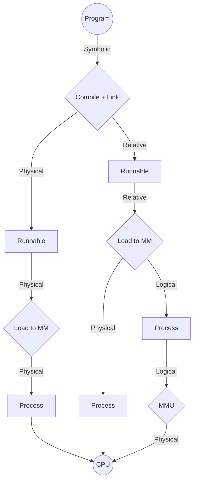

---
# Memory Addressing

[Back to index](../README.md)

---
## Types of Memory Addresses
- Symbolic. Assigned by the programmer.
- Relative. Offset to the beginning of a **runnable**.
- Logical. Offset to the beginning of a **process**.
- Physical. Real memory address used by the CPU.

---
## Physical Address Generation Steps

1. **Creating a program**
	- Symbolic addresses are used (function & variable names)
	- Easier for the programmer to understand
2. **Compilation**
	- Code is transformed to machine code.
	- Symbolic addresses are usually converted to relative ones.
		- Requires to compile each individual file.
		- Relative addr. are an offset from the beginning of the file
	- Symbolic addresses can also be converted to physical ones.
		- Is not recommended.
		- Final runnable cannot be relocated.
		- Final runnable must be loaded at a specific space in MM.
3. **Linking**
	- Same memory type.
	- For relative addr. only:
		- Puts the runnable files one after another.
		- Readjusts the relative addresses (add the size of the previous files)
	- The addresses for the external functions must be assigned.
5. **Load runnable to the MM**
	- Done by the OS module called Long Term Scheduler (LTS).
	- For physical addr. the LTS loads the runnable in the specified address.
	- For relative addresses, the LTS can:
		- Load the program wherever in MM.
		- Maintain relative addr. (now logical) or convert them to physical.
7. **Run-time translation**
	- Step only required if in the previous step we keep logical addresses.
	- Done very fast by specific hardware called Memory Management Unit.

---
## Types of bindings
Depends on the time when the physical address was obtained:
### Static correspondence (or binding)
- Obtained in compilation/linking time.
	- Neither runnable nor process can be relocated.
- Obtained in loading time.
	- Relocatable runnable but not process.
### Dynamic correspondence (or binding)
- Obtained in run time.
	- Relocatable both runnable and process.
---
## Address Spaces
### Logical Address Space
- Is the set of valid logical addresses inside a runnable.
- Goes from $0$ to $\text{size}(\text{ process }) -1$.
- Outside this range a segmentation fault happens.
### Physical Address Space
- Is the set of valid physical addresses (of the MM) inside a process.
- Each one is associated to a logical address.
- Can change in run time.
---
## Translating function or relocation
- Is the translation from logical to physical addresses.
- Is done by the Memory Management Unit
- Two ways:
	- **Base or relocation register**
		- Register containing the starting address of the process in MM.
		- Adds this register to the logical addr. to obtain the physical one.
	- **Binding table**
		- Table that contains the translations from logical to physical.
		- Avoids performing an addition every cycle.
---