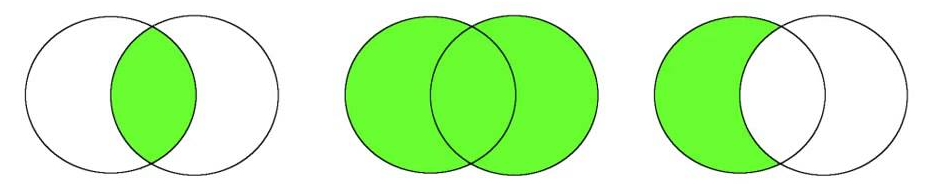
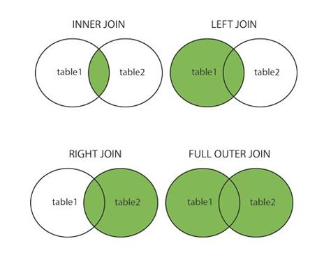

---
# 04 Queries

[Back to index](../../README.md)

---

## Simple Queries

- Syntax: `SELECT [properties] FROM [table] WHERE [condition]`
- We can use `*` as `[properties]` to specify all properties in the table.
- Elements can be ordered:
	- Ascending order with `ORDER BY [property] ASC`.
	- Descending order with `ORDER BY [property] DESC`.

```postgresql
-- Displays a list of names from student
SELECT name FROM student;

-- Displays a list of IDs and names from student
SELECT id, name FROM student;

-- Displays a all properties of the second tuple in student
SELECT * FROM students WHERE id = 2;

-- Displays a list of names from student in ascending order.
SELECT name FROM student ORDER BY name ASC;
```

## Queries with Multiple Tables

```postgresql
-- Display all the students name and they bachellor name.
SELECT student.name, bachellor.name FROM student, bachellor
WHERE student.id = bachellor.id;

-- Can be reduced.
SELECT s.name, b.name FROM student s, bachellor b
WHERE s.id = b.id;
```

## Set Theory with Queries

- Syntax: `[query 1] [operation] [query 2]`
- Where `[operation]` can be 
	- Intersection: `INTERSECT`
	- Union: `UNION`
	- Minus: `EXCEPT`



```postgresql
-- Display all names in erasmus AND student.
-- A x B : erasmus x student
(SELECT name FROM erasmus) INTERSECT (SELECT name FROM student)

-- Display all names in student OR teacher.
-- A + B : teacher + student
(SELECT name FROM teacher) UNION (SELECT name FROM student)

-- Display all names in student NOT IN erasmus.
-- A - B : student - erasmus
(SELECT name FROM student) EXCEPT (SELECT name FROM erasmus)
```

## Joining Queries

- Syntax: `SELECT [properties] FROM ( [table 1] JOIN [table 2] ON [condition] )`



```postgresql
-- INNER JOIN.
-- (Tuples not related will not be displayed)
SELECT s.name, b.name FROM
(student s INNER JOIN bachellor b ON s.id = b.id);

-- LEFT JOIN.
-- (Bachellors not related will not be displayed, but students will)
SELECT s.name, b.name FROM
(student s LEFT JOIN bachellor b ON s.id = b.id);

-- RIGHT JOIN.
-- (Students not related will not be displayed, but bachellors will)
SELECT s.name, b.name FROM
(student s RIGHT JOIN bachellor b ON s.id = b.id);

-- FULL JOIN.
-- (Not related tuples will also be displayed)
SELECT s.name, b.name FROM
(student s FULL JOIN bachellor b ON s.id = b.id);
```