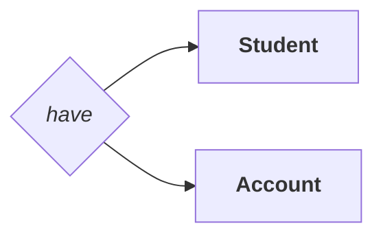
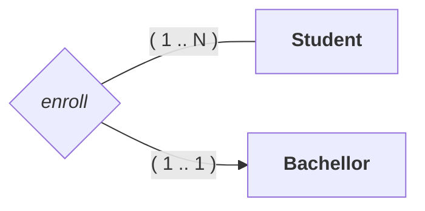
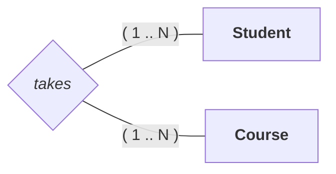
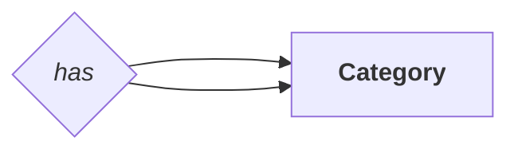
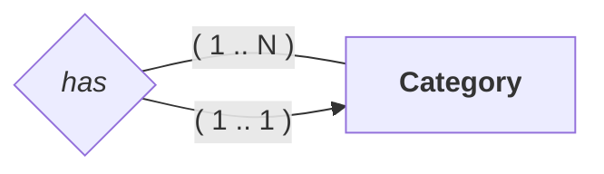
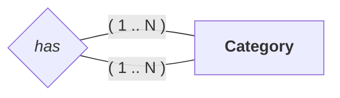
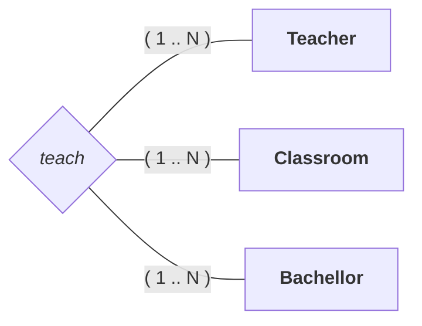
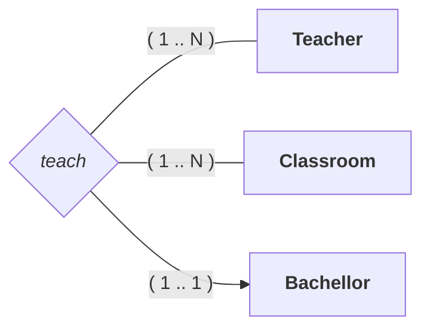
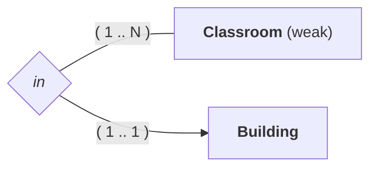
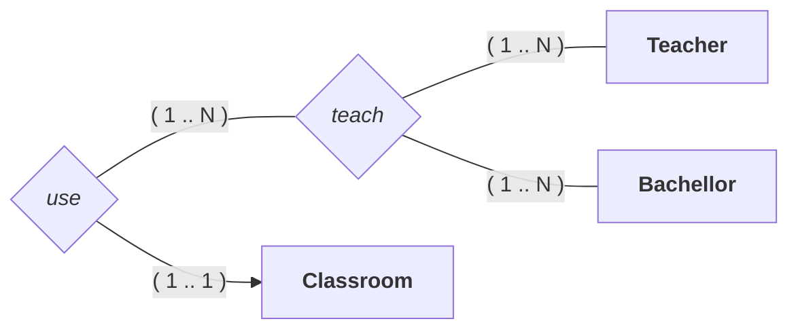

---
# Relational Model

[Back to index](../../README.md)

1. Basic Notions
2. Attributes
3. Relations
4. Weak Entities
5. Aggregation
6. Generalization

---

## Basic Notions

- Both attributes and relations are represented by tuples.
- Tuples are represented with parenthesis.
- Values are separated by commas.

## Attributes

- In composite attributes only appears the values that compose the attribute.

```Relational
# Primary Keys start with @
Student = (@id, name)
Book = (@[ISBN, version], name)

# Foreign Keys must be specified
Student = (@id, idCourse (FK to Course))

#  Multi-value attributes are represented apart
Course = (@id)
Places = (@[idDate, idCourse (FK to Course)], name)

# Derivated are represented with a *
Student = (@id, birthdate, age*)
```

## Relations
### 1:1 Relations


```Relational
# Option 1
Student = (@idStudent, idAccount (FK to Account) (Unique))
Account = (@idAccount)

# Option 2
Student = (@idStudent)
Account = (@idAccount, idStudent (FK to Student) (Unique))
```

### 1:N Relations


```Relational
Student = (@idStudent, idBachellor (FK to Bachellor))
Bachellor = (@idBachellor)
```

### N:N Relations


```Relational
Student = (@idStudent)
Bachellor = (@idBachellor)

Enroll = ( @[
	idStudent (FK to Student),
	idBachellor(FK to Bachellor)
])
```

### Reflexive 1:1 Relations

```Relational
Category = (@idCategory, idCategory (FK to Category) (Unique) )
```


### Reflexive 1:N Relations

```Relational
Category = (@idCategory, idCategory (FK to Category) )
```

### Reflexive N:N Relations

```Relational
Category = (@idCategory)
Has = ( @[
	idCategory (FK to Category),
	idCategory (FK to Category)
])
```

### Multidirectional N:N:N Relations

```Relational
Teacher = (@idTeacher)
Bachellor = (@idBachellor)
Classroom = (@idClassroom)

Teach = (
	@[
		idTeacher (FK to Teacher),
		idClassroom (FK to Classroom),
		idBachellor (FK to Bachellor)
	],
)
```
### Multidirectional N:1:N Relations
- The N related are considered PK.
- The 1 related are considered just FK

```Relational
Teacher = (@idTeacher)
Bachellor = (@idBachellor)
Classroom = (@idClassroom)

Teach = (
	@[
		idTeacher (FK to Teacher),
		idClassroom (FK to Classroom)
	],
	idBachellor (FK to Bachellor)
)
```

### Multidirectional N:1:1 Relations

```Relational
Teacher = (@idTeacher)
Bachellor = (@idBachellor)
Classroom = (@idClassroom)

Teach = (
	@[
		idTeacher (FK to Teacher),
		idClassroom (FK to Classroom)
	] (Unique),
	idBachellor (FK to Bachellor)
)
```

## Weak entities

```Relational
Building = (@idBuilding)
Classroom = ( @[
	idClassroom
	idBuilding (FK to Building)
])
```

## Aggregation 
### Aggregation N:N + N:N


```Relational
Teacher = (@idTeacher)
Bachellor = (@idBachellor)
Classroom = (@idClassroom)

Teach = ( @[
	idTeacher (FK to Teacher),
	idBachellor (FK to Bachellor)
])

Use = ( @[
	(idTeacher, idBachellor) (FK to Teach),
	idClassroom (FK to Classroom)
])
```

### Aggregation N:N + N:1
- The 1 relation is no more a PK.


```Relational
Teacher = (@idTeacher)
Bachellor = (@idBachellor)
Classroom = (@idClassroom)

Teach = ( @[
	idTeacher (FK to Teacher),
	idBachellor (FK to Bachellor)
])

Use = (
	@[ (idTeacher, idBachellor) ] (FK to Teach),
	idClassroom (FK to Classroom)
)
```

### Aggregation N:N + 1:1
- The 1 relation is no more a PK.


```Relational
Teacher = (@idTeacher)
Bachellor = (@idBachellor)
Classroom = (@idClassroom)

Teach = ( @[
	idTeacher (FK to Teacher),
	idBachellor (FK to Bachellor)
])

Use = (
	@[ (idTeacher, idBachellor) ] (FK to Teach),
	idClassroom (FK to Classroom) (Unique)
)
```

## Generalization
Having Student and Teacher be Members.
```Relational
Member = (@idMember, ...)
Student = (@idMember (FK to Member), ...)
Teacher = (@idMember (FK to Member), ...)
```
