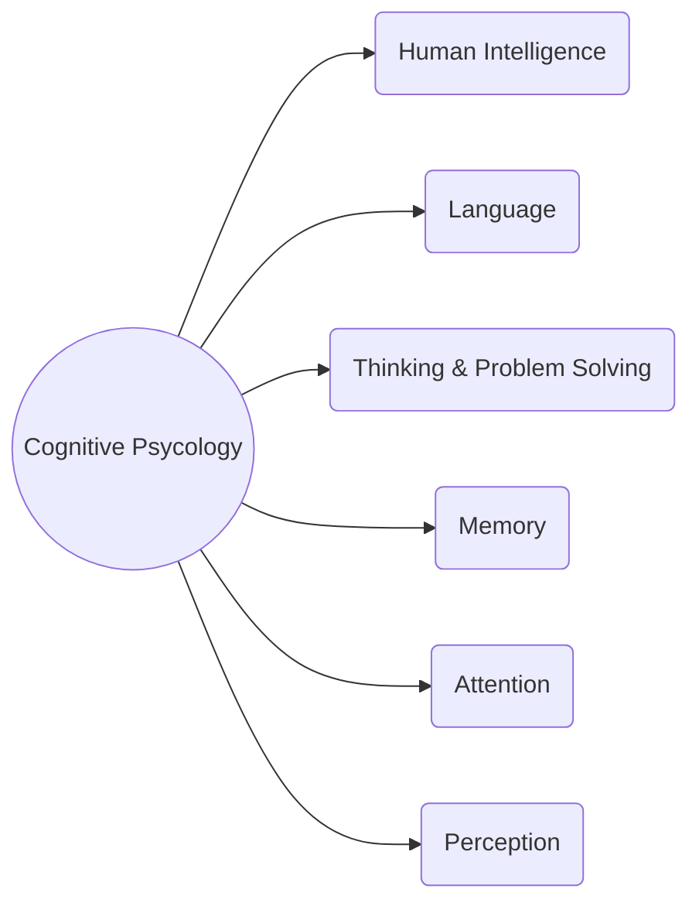

---
# UI Evaluation

[Back to index](../README.md)

---

## Expert-based Evaluation

Based on cognitive psychology, we try to identify potential problems.



First identify a usability criteria (heuristics) and then study them.
Some common heuristics are:
- System behaviour is predictable.
- System behaviour is consistent (use conventions).
- Feedback is provided.
- System uses "real world" language.
- User control and freedom (undo & redo)
- Error prevention.

A review-based evaluation relies on experimental results and empirical evidence.

## Evaluation though user participation

- **Observational methods:**
	- **Think aloud**. Users are asked to describe what they do and why.
	- **Cooperative evaluation**. Users and evaluator ask questions to each other.
	- **Protocol analysis**. Requires expert analysis of means of recording.
	- **Automated analysis**. Videotaping with automated annotation/response (quantitative).
	- **Post-talk walkthroughs**. Recording is played back to participants for comments.
- **Query techniques:**
	- **Interviews**. List of questions asked to the user one-to-one.
	- **Questionnaires**. List of questions to the users (less personal).
- **Physiological methods:**
	- **Eye tracking**.
	- **Physiological measurements**. Emotional response linked to physical changes.

## Automated acceptance tests

They are tests that can be run in front of a user to verify if the product meets the acceptance criteria.

One technique is **Behaviour-Driven Development (BDD)** that uses user stories and scenarios to define the features and expected outcomes of the product.

```text
As a [role]
I want [feature]
So that [benefict]

Scenarios:
  - Given [context]
  - when [event]
  - then [outcome]
```

Some tools are: Cucumber and Selenium plugin.

## Evaluation during active use

Is a strategy to collect feedback and improve future releases of a product after it is released. Some methods are:

- Interviews.
- Data logging.
- Online/Telephone Consultants.
- Online suggestions / email.
- Discussion groups.