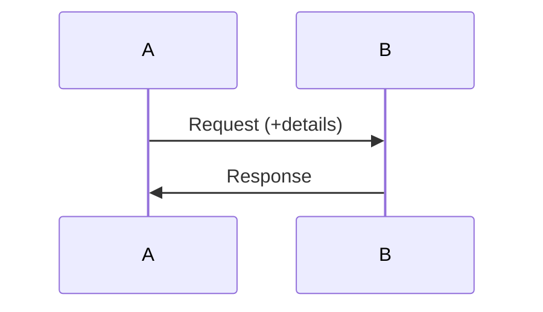
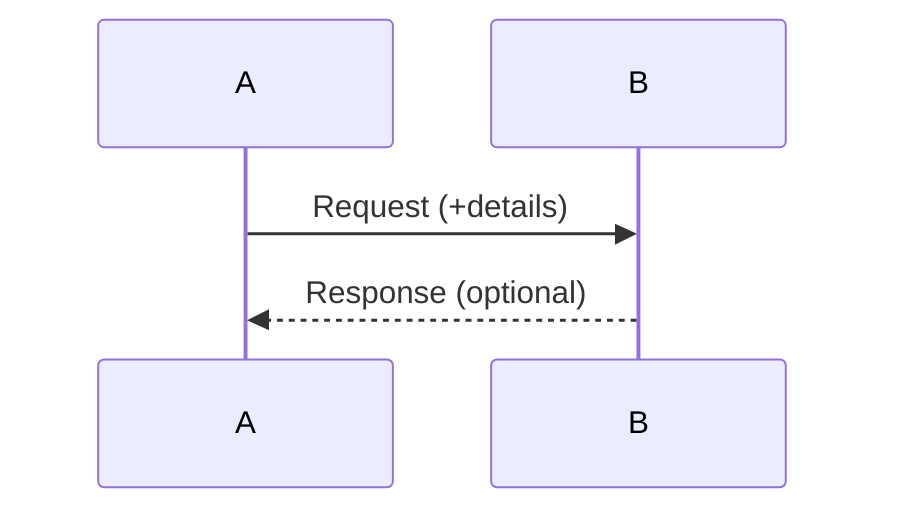
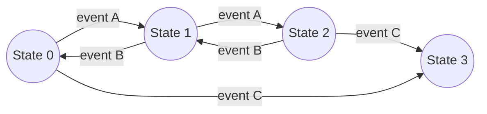
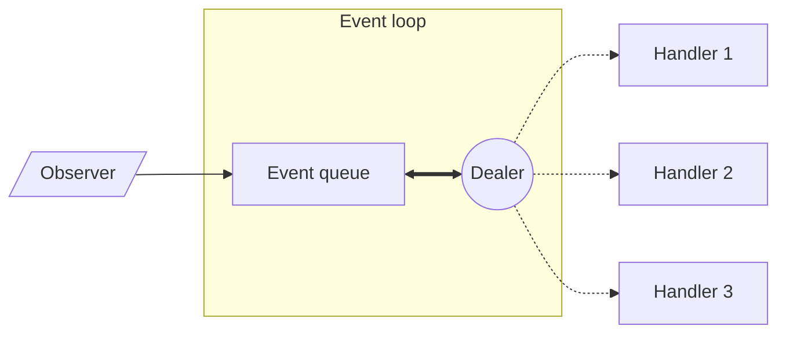

---
# Event Driven Design

[HOME](../../README.md)

---
## Event Driven Programming (EDP)
### Definition
The execution flow of the program varies depending on some events.
### Program State
- The program state is difficult to determine.
- There are usually concurrent (parallel) programs.
- There are several modules:
	- Can run a different speeds.
	- Can run simultaneously.
	- Some can not necessarily run.
	- Can have several instances running.
### Events
- Events are an observable occurrence.
- Events can happen at any instant.
- Events can be external or internal.
### Event Response
- There is an observer that responds (handles) an event.
- The observer is frequently called event handler or controller.
### Event Sources
- Some events are launched by an agent.
- The agent is called event source.
---
## Event Based Systems (EBS) Interactions
### Definition
- A system is a set of agents that:
	- Change their behaviour depending on its state.
	- Interact between them in several ways (events).
- The system state is the state of all the agents at a specific time.
- A EBS is discrete if:
	- It has a finite set of states and changes.
	- Every state has a next state.
### Request-Response Interaction
- Involves only two agents.
- Response is mandatory.

### Message passing Interaction
- Involves only two agents.
- Response is optional.

### Publication-Subscription Interaction
- Involves multiple agents.
- Several B agents subscribe to A.
- Several A agents publish several types of messages.
- B agents receive messages from A agents if they are subscribed.
---
## The EDP Paradigm
### Event Model
- EDP is a paradigm whose core are the events.
- Objects linked to events:
	- Event Source. Generates the event.
	- Event Objects. Encapsulates event data.
	- Event Handler. Responses to the event.
### Events vs method calls
1. Event source and handler have a weaker coupling (independence).
2. Event handlers can be connected to several events at different times.
3. Events can have 0 or more handlers.
4. Event handlers does not return any value.
5. Same handler can control events from different sources.
6. Event sources (usually) do not need to wait for the handler to finish.
7. Events can be handled with delay.
---
## EDP Design
### Event response
- Event handlers can have:
	- A unique response algorithm.
	- Different responses depending on the system state.
- Some events can be an Action Not Allowed (ANA) for specific states.
### EBS representation
- **State graph** represents the states, the events and the allowed changes.

- **State table** is the table representation of the state graph.

| State | event A | event B | event C |
| :---: | :-----: | :-----: | :-----: |
|   0   |    1    |   ANA   |    3    |
|   1   |    2    |    0    |   ANA   |
|   2   |   ANA   |   ANA   |    3    |
|   3   |   ANA   |   ANA   |   ANA   |

- **Actions table** provides a description of what each event does in each state.
---
## Events Infrastructure
### Definition
- Is an infrastructure that allows to develop and execute event-based programs.
- Constant loop of events.
### Requirements
- Event handlers.
- Usually stablish a time deadline for processing an event (Real Time Systems).
- Concurrent event handling in overlapping times.
### Structure

### Dealer (Planner)
- Calls the event handlers when the event is triggered.
- Approaches:
	- **Push (direct delivery)** . Event source triggers the dealer on an event.
	- **Pull**. Dealer periodically checks the event sources for an event.
### Event Queue
- In direct delivery:
	- Events can reach the dealer before it finishes handling another event.
- A event queue is required. Its size is critical.
---
## Concurrency
### Thread
- Is a mechanism to implement concurrency.
- Advantages:
	- Avoid sequential behaviour.
	- More efficient. Programs can use:
		- Several cores.
		- Shared resources.
### Java Threads
- Two ways:
	- Inherit from `Thread`.
	- Implement `Runnable` interface.
- Methods
	- `run()` contains the code to be executed in the thread.
	- `start()` starts the execution in a new thread.
### Java Thread Class
- **Static attributes**:
	- `Thread.MIN_PRIORITY`
	- `Thread.NORM_PRIORITY`
	- `Thread.MAX_PRIORITY`
- **Constructors**:
	- `Thread()`
	- `Thread(String name)`
	- `Thread(Runnable target)`
	- `Thread(Runnable target, String name)`
- **Static Methods**:
	- `currentThread()`. Get reference of the currently executing thread.
	- `sleep(long millis)`. Currently executing thread goes to sleep.
	- `yield()`. Currently executing thread frees the CPU.
- **Non-static Methods**:
	- `name` & `priority` setters and getters.
	- `isAlive()`. Check if a thread is alive.
	- `join()`. Main thread waits for the thread to finish.
	- `join(long millis)`. Main thread waits only for some time.
	- `run()`. Runs the code of the runnable object (if present).
	- `start()`. The thread starts is execution.
### Thread States
- `NEW`. Created but not started.
- `RUNNABLE`. Started but waiting for the CPU.
- `BLOCKED`. Waiting for a semaphore in a synchronized area.
- `WAITING`. Waiting indefinitely for another thread.
- `TIMED_WAITING`. Waiting with a timer for another thread.
- `TERMINATED`. Execution finished.
### Program Correctness
#### Liveness Properties
- **Live-lock**. Execution of instructions without making progress.
- **Starvation**. Low-priority threads cannot use CPU time.
#### Safety Properties
- **Mutual exclusion**. Avoid simultaneous access to shared resources.
- **Synchronisation**. Some thread have to wait for another.
	- Producer-Consumer problem.
- **Deadlock.** All threads wait for an event that will not happen.
#### Solutions
- **Semaphore** (or mutex) is the primitive way of blocking/releasing a resource.
	- `P(mutex)` to block a resource.
	- `V(Mutex)` to free a resource.
- Higher level mechanisms:
	- **Critical regions** grant exclusive access to a section of code.
	- **Monitors** are abstract datatypes that gran exclusive access to them.
	- **Signals and message passing** among concurrent processes.
### Java Concurrency Correctness
#### Semaphores
```java
private static Object shared;
private Semaphore mutex = new Semaphore(1, true);

public void run() {
	mutex.acquire() //P(mutex)
	// Critical section here
	// Use shared object.
	mutex.release() // V(mutex)
}
```
#### Synchronised for mutual exclusion
```java
private static Object shared;
private Object mutex = new Object();

public void run() {
	synchronized(mutex) {
		// Critical section here
		// Use shared object.
	}
}
```
#### Synchronised for Synchronization
```java
private static Object shared;

public synchronized void myMethod() {
	while (cond) wait(); // Wait for a notification
	...
	notify();
	...
}
```
---