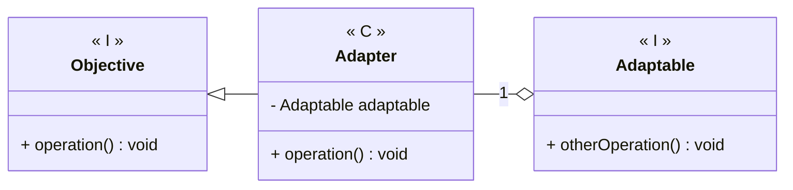

---
# Adapter

[Back to index](../README.md)

---
## Description

Allows the use of one or more classes as if they were of another class.

## Characteristics

- We implement an adapter class.
	- It inherits from the objective class.
	- It contains an instance of the adaptable class.
	- We implement each method using the adaptable class.

## UML


## Code

```java
public class Objective { 
	public Objective() { ... }
	public void operation() { ... }
}

public class Adaptable { 
	public Adaptable() { ... }
	public void otherOperation() { ... }
}

public class Adapter {

	private Adaptable adaptable;

	public Adapter(Adaptable tmp) {
		adaptable = tmp;
	}
	
	public void operation() {
		adaptable.otherOperation();
	}
}
```