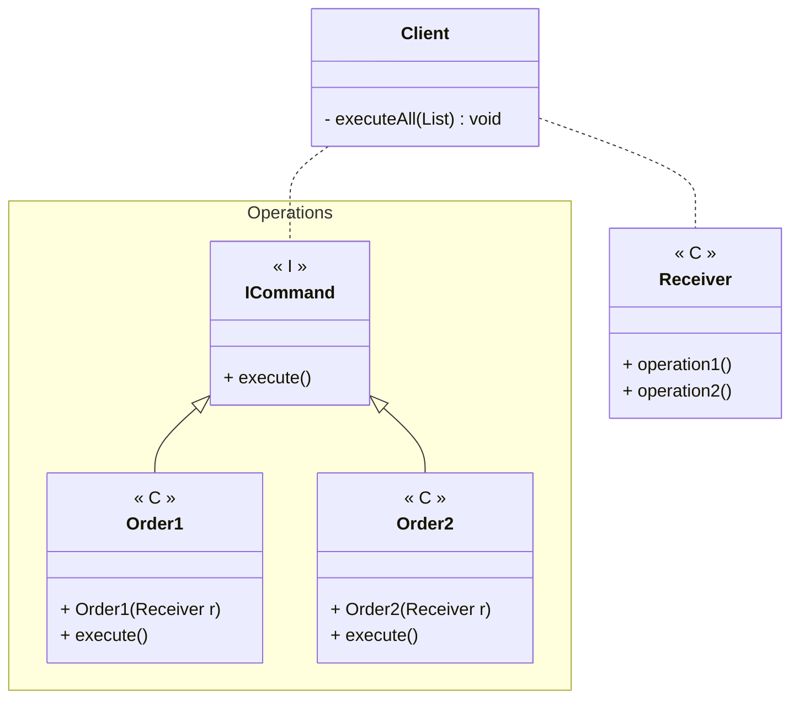

---
# Command

[Back to index](../README.md)

---

## Description

Used to execute sequences of instructions in different orders to an object.

## Characteristics

- The receiver is the object that contains all the actions.
- The Client creates a list of Commands and then executes them one by one.

## UML


## Code

```java
public class Client { 
	public static void main(String[] args) {

		// Create a receiver object
		Receiver receiver = new Receiver();
		
		// Create a sequence of actions for the receiver
		List<ICommand> commands = new ArrayList<ICommand>();
		commands.add(new Order1(receiver));
		commands.add(new Order2(receiver));

		// Execute all the actions
		executeAll(commands);
	}

	private static void executeAll(List<ICommand> commands) {
		for(ICommand command : commands)
			command.execute();
	}
}
```