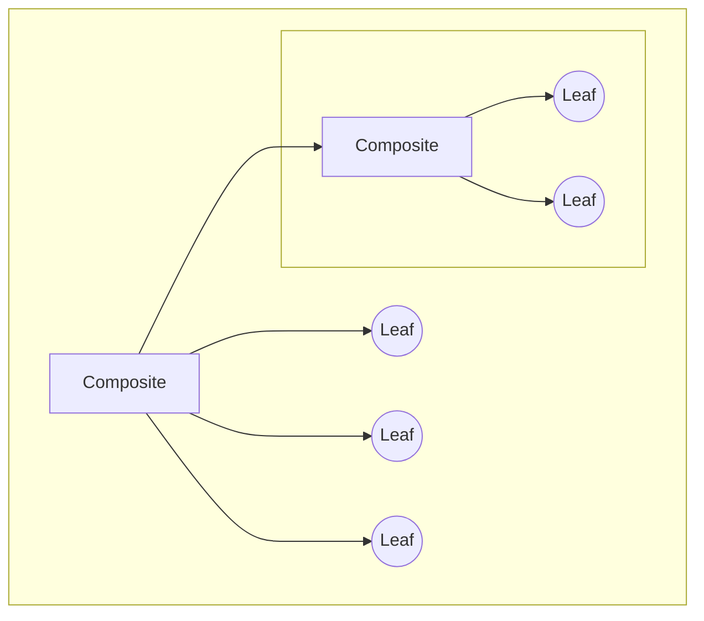
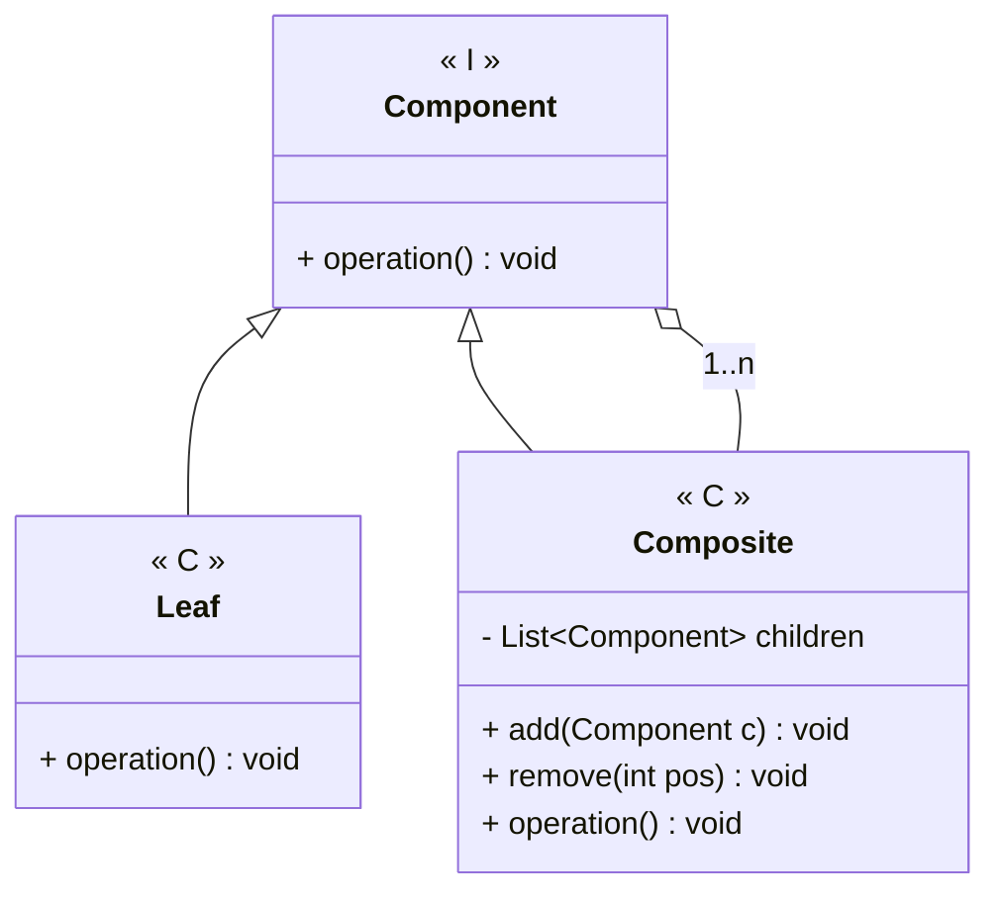

---
# Title

[Back to index](../README.md)

---

## Description

Allows to treat groups of objects as if they were a single object.
Similar to a tree data structure.



## UML


## Code

```java
public class Component { 
	public abstract void operation();
}

public class Leaf {
	public Leaf() { ... }
	public void operation() { ... }
}

public class Composite {

	private List<Component> children;
	
	public Composite() { ... }

	/***************************************
	 *  Children management
	 */
	public void add(Component c) {
		children.add(c);
	}
	
	public void remove(int pos) {
		children.remove(pos);
	}
	
	/***************************************
	 *  Recursive operations
	 */
	public void operation() {
		for(Component c : children)
			c.operation();
	}
	
}
```