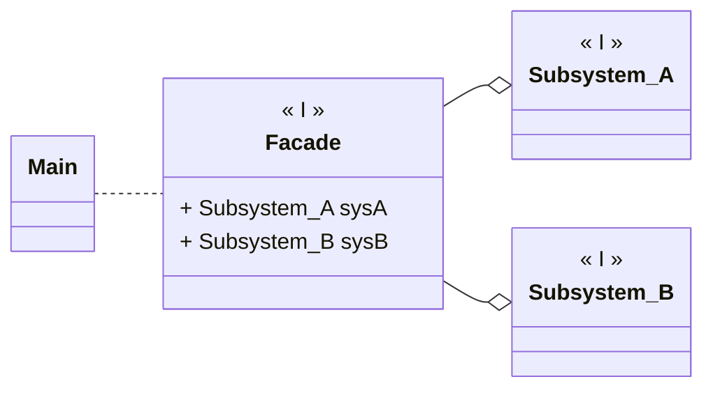

---
# Title

[Back to index](../README.md)

---
## Description

Provides a unified interface to facilitate the use of one or more subsystems.

## UML


## Code

```java
/***************************************
 *  SUBSYSTEMS
 */
public class Subsystem_A { 
	public Subsystem_A() { ... }
	public void operation() { ... }
}

public class Subsystem_B { 
	public Subsystem_B() { ... }
	public void operation() { ... }
}

/***************************************
 *  FACADE PATTERN
 */
public class Facade {

	private Subsystem_A sysA;
	private Subsystem_B sysB;

	public Facade() {
		sysA = new Subsystem_A();
		sysB = new Subsystem_B();
	}
	
	public operation() {
		sysA.operation();
		sysB.operation();
	}
}
```