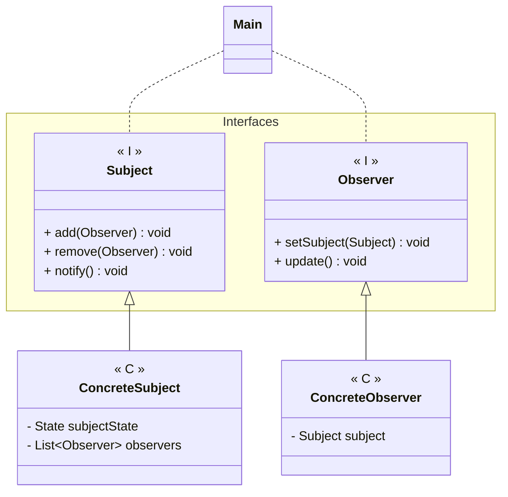

---
# Observer

[Back to index](../README.md)

---

## Description

Allows to modify several objects (Observers) based on changes in other object (subject).

## Characteristics

- Subject notifies Observers when there is a change.
- Notified Observers change accordingly to its associated Subject

## UML


## Code

```java
public class ConcreteSubject implements Subject{
	private List<Observer> observers;
	private boolean changed; //Subject state

	public ConcreteSubject() { ... }

	public void add(Observer o) {
		observers.add(o);
		o.setSubject(this)
	}
	
	public void remove(Observer o) {
		observers.remove(o);
	}

	public void notify() {
		for(Observer o : observers)
			o.update();
		changed = false;
	}

	public void operation() {
		changed = true;
		notify();
	}
}

public class ConcreteObserver implements Observer{
	private Subject subject;
	
	public void setSubject(Subject s) {
		this.subject = s;
	}

	public void update() { ... }
}
```