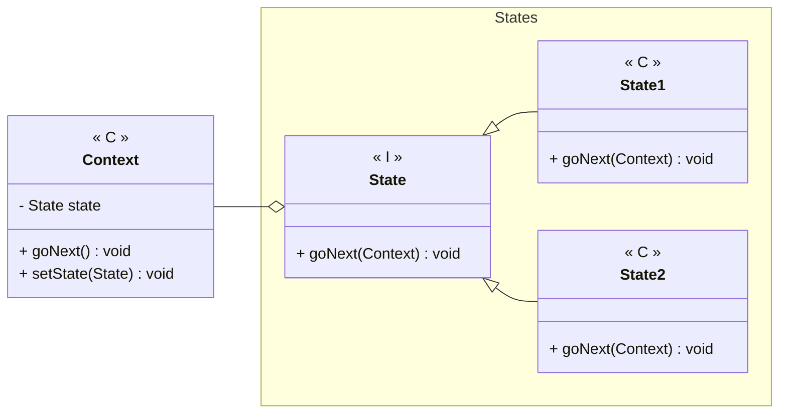

---
# State

[Back to index](../README.md)

---

## Description

Allows to modify the behaviour of an object depending on a internal state.

## Characteristics

- 

## UML


## Code

```java
public class Context { 
	private State state;

	public Context() {
		// Initial State
		state = new State1
	}

	public void goNext() {
		state.goNext(this);
	}

	public void setState(State s) {
		state = s
	}
}

public class State1 implements State {
	@Override
	public void goNext(Context c) {
		c.setState(new State2)
	}
}

public class State2 implements State {
	@Override
	public void goNext(Context c) {
		c.setState(new State1)
	}
}
```